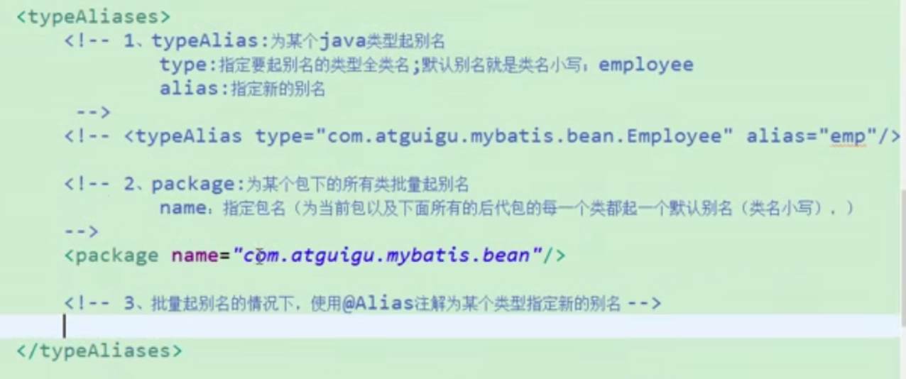
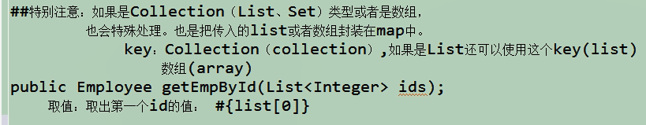
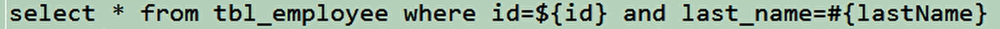
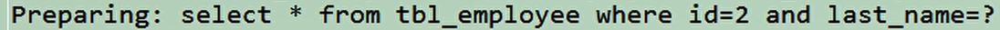
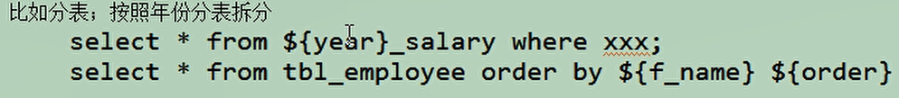
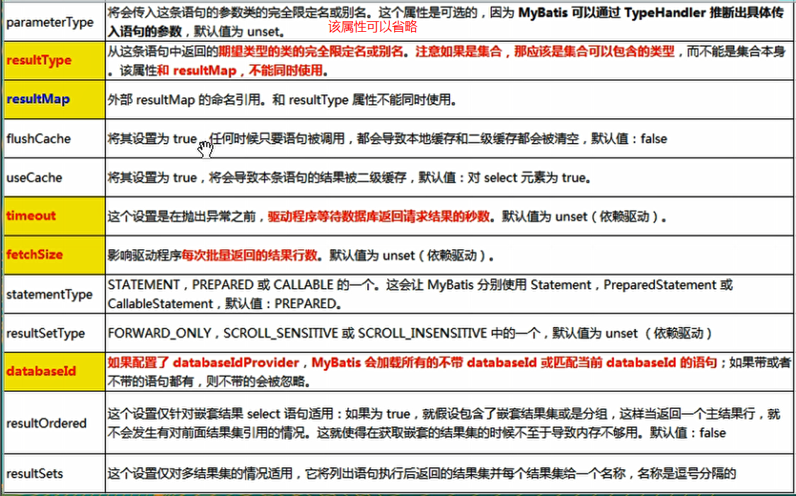

### 开始看2-29

#### SqlSession和connection（hibernate）都是非线程安全，所以不能声明在成员变量中

#### mapper接口没有实现类，但是mybatis会为这个接口生成代理对象，将接口和XML文件进行绑定，从而可以使用代理对象来调用接口中的方法。（sqlSession对象是由全局配置文件生成的，因此通过sqlSession对象去获得mapper接口实现类的代理对象，这样就将mapper接口和XXXmapper.xml文件绑定在一起了）

tips:由`sqlSessionFactory.openSession()`创建的sqlSession，默认参数是false（隐式），在增删改操作之后是需要手动commit的，如果参数是true，则是自动commit.

例子：

```java
EmployeeMaaper empMapper = sqlSession.getMapper(EmployeeMaaper.class);
--此时生成的empMapper 则为代理对象
```

#### SqlSessionFactory可以由mybatis-config.xml这个*全局配置文件*创建，也可以不用mybatis-config.xml文件来创建，另外一种方式待续。。


#### resource属性是引入类路径(classpath)下的资源，url属性是引入网络路径或者是磁盘路径下的资源。

注：类路径就是类似于IDEA中的Resource目录，类路径的根目录就是Resource目录中的第一级目录

例如：在mybatis-config.xml文件中引入外部属性文件

```xml
#该dbconfig.properties文件此时是放在类路径下的根目录
<properties resource="dbconfig.properties"></properties>

<properties url="d:/XX/XX/dbconfig.properties"></properties>
```


#### 别名




#### 全局配置文件（mybatis-config.xml）中的`<mappers>`标签

* ##### 作用：将sql注入到全局配置中

* ##### 子标签:`<mapper>`

  * 作用是注册sql映射

    1. 通过注册配置文件来注册sql映射

    ​    例子：

    ```xml
    <mapper resource="mapper/EmployeeMapper.xml"></mapper>
    #注：此处是以resource属性来引入xml文件，也可以使用url的引入方式
    ```

    2. 通过注册接口来注册sql映射

       例子：

       ```xml
       <mapper class="mapper接口的全类名"></mapper>
       #注：这种引用方式下，映射文件名必须和接口同名(一般情况下都是同名的)，并且将映射文件放在与接口同目录下
       ```

    3. 批量注册

       批量注册情况下，要求映射文件名必须和接口同名(一般情况下都是同名的)，并且将映射文件放在与接口同目录下或者mapper接口的包名与XXmapper.xml文件的包名相同。

       ```xml
       <mapper packge="mapper接口的全类名"></mapper>
       ```

* ##### 子标签：`<package>`

  * 作用也是可以实现sql映射文件的批量引入

    批量注册情况下，要求映射文件名必须和接口同名(一般情况下都是同名的)，并且将映射文件放在与接口同目录下或者mapper接口的包名与XXmapper.xml文件的包名相同。

    例子：

    ```xml
    <package name="mapper接口的包名"></package>
    ```


### Mybatis的参数处理

**原理** ：是将mapper接口的参数封装到一个map中，在xml中通过map中的key来取值。

*注：单个参数时，不会封装到map* 。

**单个参数** ：mybatis不会做特殊处理，此时#{参数名}中的参数名可以随便写，可以不与接口中的参数名一致。

**多个参数** ：当mapper接口中传入多个参数时，可以使用`命名参数`的方法，在mapper接口中指定参数名字，以便在xml文件中来使用这些指定名称的参数。

例子：

```java
#在mapper接口的方法参数上添加@Param("指定参数名")
Employee getEmpByIdAndName(@Param("id")Integer id,@Param("name")String name);
```

```Xml
#此处#{id}中的id和#{name}中的name就是mapper中所指定的参数名
<select id="getEmpByIdAndName" resultType="XX.XX.Employee">
    select * from tb_emploee where id = #{id} and name = #{name}
</select>
```

除了使用`命名参数`的方法指定传参名，当这些参数是数据模型(`POJO`或者`DTO`)中的属性时，可以直接用`POJO`或者`DTO`来作为参数。

例子：

```java
#将前端传过来的查询参数映射到Employee中。
Employee getEmpByIdAndName(Employee dto);
```

```xml
#此处#{id}中的id和#{name}中的name就是Employee中的属性
<select id="getEmpByIdAndName" resultType="XX.XX.Employee">
    select * from tb_emploee where id = #{id} and name = #{name}
</select>
```

其次还可以使用Map来封装参数。

例子：

```java
Employee getEmpByIdAndName(Map<String,Object> map);
```

```java
#业务层将参数封装进map
Map<String,Object> map = new hashMap<>();
map.put("id",1);
map.put("name","Tom");
Emploee e = mapper.getEmpByIdAndName(map);
```

```xml
#此处#{id}中的id和#{name}中的name就是map中的键
<select id="getEmpByIdAndName" resultType="XX.XX.Employee">
    select * from tb_emploee where id = #{id} and name = #{name}
</select>
```

**特别注意** ：如果参数是Collection类型或数组类型，在xml文件中取值应该是list[index]、set[index]、array[index]。如下：



### Mybatis的参数获取

在XXXmapper.xml中,获取参数的方式有两种：

* #{}：可以获取map中的值或者POJO/DTO中的属性值
* ${}：同样可以获取map中的值或者POJO/DTO中的属性值

两种方式的区别：

#{}：是以预编译的形式，将参数设置到sql语句中，就类似JDBC中的PrepareStatement，这样可以有效防止sql注入。

${}：取出的值是直接拼接在sql语句中，存在sql注入的安全问题。 

演示效果：

XXXmapper.xml中的sql语句如下



执行后的输出日志中的sql语句如下



大多数情况下，使用的是#{}来取值。只有当需要进行sql拼接(或是不支持占位符？)的时候才用到${}来取值。如下示例：







### 自定义结果映射规则---resultMap

使用resultMap标签自定结果映射规则

```xml
<resultMap type="xx.xx.Employee" id="MySimpleEmp">
		<!--指定主键列的封装规则
		id定义主键会底层有优化；
		column：指定哪一列（数据库字段）
		property：指定对应的javaBean属性
		  -->
		<id column="id" property="id"/>
		<!-- 定义普通列封装规则 -->
		<result column="last_name" property="lastName"/>
		<!-- 其他不指定的列会自动封装,但是一般我们只要写resultMap就把全部的映射规则都写上。 -->
		<result column="email" property="email"/>
		<result column="gender" property="gender"/>
</resultMap>
```

然后在select标签中使用resultMap属性来引用上面的规则

```xml
<select id="getEmpById"  resultMap="MySimpleEmp">
		select * from tbl_employee where id=#{id}
</select>
```

