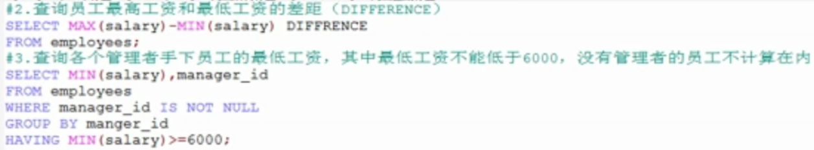
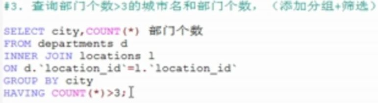
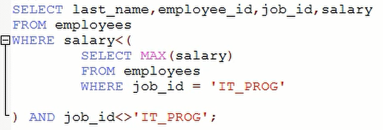

# 开始看95

#### 1.  “+”号的作用

在mysql中加号只有一个作用，那就是作为运算符。

* 若两个操作数都为数值型，则做加法运算；

* 若两个操作数其中一方为字符型，则会试图将字符型转换成数值型，如果转换成功，则继续做加法运算，如果转换失败，则将字符型操作数转换成 0 ,再进行加法运算。
* 若两个操作数的其中一方为null，则结果肯定为null。

#### 2. 使用concat实现字符连接


#### 3. DESC+表名  可以查看指定表的结构


#### 4. IFNULL函数

IFNULL(参数一，参数二)，参数一是字段名，参数二是若参数一为null，则要设置的值。

例子：查询工资表里所有的员工的员工对应的工资，若工资为null,则显示0。

```sql
select last_name,IFNULL(bill,0) from tb_salary;
```

#### 5. 转义关键字  ESCAPE

例子：查询员工中第二个字符为 _ 的员工名

```sql
select last_name
from empolyees 
where last_name like '_$_%' ESCAPE $;
```

ESCAPE后面跟的字符可以随意规定。

**Tip:** **使用 \ 也可以对字符进行转义** 


#### 6. in 不支持通配符

```sql
--错误示例
select 
last_name
from
employees
where
job_id IN('IT_PROT','AD%')

```


#### 7.Mysql中不支持用 = 号来判断是否为null值，而是使用ISNULL()函数，或者将使用 is null 

例子：查询出user表中姓名不为null的数据

```sql
--错误示例：
SELECT * from servlet.`user` WHERE `name`=NULL
--正确示例1：
SELECT * from servlet.`user` WHERE ISNULL(`name`)
--正确示例2：
SELECT * from servlet.`user` WHERE `name` IS NULL
```

##### 注意：mysql中的人为输入的 null 和没有被赋值的字段的null 不是一个意思，前者是指该字段的数据被赋值为null ，后者是指该字段没有被赋予任何值。所以再判断是否为null 时，所查出的结果是指第二种的null，也就是没有被赋值的字段。


#### 8.排序（关键字：order by）

**attention:  order by 子句一般放在查询语句的最后，但是除了有limit子句的情况外。**

**查询语句的执行先后顺序：from、where、select、order by、limit**


排序时可以根据**别名**和**表达式**进行排序,例子如下： 

##### 1.根据表达式或者函数排序

查询所有用户的姓名、用户名、密码，并且按照姓名长度升序

```sql
SELECT LENGTH(username) 姓名长度,
username 姓名,
`password` 密码,
`name` 用户名 
FROM `user` 
ORDER BY LENGTH(username)  --这里根据函数排序
```

结果为：


##### 2.根据别名排序

```sql
SELECT LENGTH(username) 姓名长度,
username 姓名,
`password` 密码,
`name` 用户名 
FROM `user` 
ORDER BY 姓名长度
```

结果和上面相同。

##### 3.根据多个字段排序

例子：查询用户信息，要求先按姓名长度降序，再按姓名升序

```sql
SELECT LENGTH(username) 姓名长度,
username 姓名,
`password` 密码,
`name` 用户名 
FROM `user` 
ORDER BY LENGTH(username) DESC,username ASC
```

结果为：


#### 9.mysql中的索引是从1开始


#### 10.去首尾字符函数(默认去掉空格)（trim）

```sql
--函数格式：TRIM([remstr FROM] str)
--可选参数：remstr FROM   remstr指要去掉的字符 from指从哪个字符串
--必选参数：str 指需要去字符的字符串
```

 

#### 11.单行函数

* 字符函数

* 数学函数

* 日期函数

  

* 流程控制函数

  


#### 12.分组函数

* sum、avg、max、min、count都是忽略null值的。

* 分组函数可以和distinct搭配使用

  例子：先去重，后求和

  ```sql
  select sum(distinct salary) from employees
  ```

* 和分组函数一同查询的字段要求是group by 后面的字段

* having关键字(**注：having用于分组后筛选，where用于分组前筛选**)

  **having的使用规则：若出现分组函数作为筛选条件的话(即出现'最大(高)的XXX大于或小于XX'、‘最小(低)的XXX大于或小于XX'.......)，就一定要使用having**。还有就是条件是分组之后的数据的话，也要用having。

  例子：

  


##### tip:


* group by 后面跟的可以是数据库字段（单个字段或者多个字段）、表达式、函数

* group by 和having后都支持别名，但是**where后面不支持字段别名**，**但是支持表别名，如果为表起了别名，则查询的字段就不能使用原来的表名去限定了**。

* 分组后再添加排序，例子：

  


  练习：

  


#### 13.连接查询

按功能分类：

​	内连接：

​		自连接（特殊的等值连接）

​		等值连接    |   n表连接至少需要n-1个连接条件

​		非等值连接

​	外连接：

​		左外连接

​		右外连接

​		全外连接（mysql中不支持）

​	交叉连接：


sql92语法:

等值连接，例子：


自连接，例子：


sql99语法：内连接（inner可以省略）


等值连接，例子：





外连接：

​	应用场景：用于查询一个表中有，另外一个表没有的记录

特点：


主表的选择：所要查询的数据大多数来自哪个表，就把哪个表作为主表。


例子：


#### 14.子查询

* 介绍

  


* ##### 重点：where或having后面的子查询

  

  * 标量子查询

    例子：查询最低工资大于50号部门最低工资的部门id和其最低工资

  ```sql
  #步骤一：查询50号部门的最低工资
  select min(salary) 
  from employees
  where department_id = 50
  
  #步骤二：查询每个部门的最低工资
  select min(salary),department_id
  from employees
  group by department_id
  
  #步骤三：在二的基础上筛选，满足min(salary)>步骤一的
  select min(salary),department_id
  from employees
  group by department_id
  having min(salary) > (
      select min(salary) 
      from employees
      where department_id = 50
  )
  
  ```

  ​	注：子查询的执行优先于主查询执行，主查询的条件用到了子查询的结果


  * 列子查询
    例1：

    
    
    等价于：（小于其中一个等价于小于其中的最大值）
    

    例2：

    
    
    等价于：（小于所有的等价于小于其最小值）

    


    tip:    IN 等价于  =ANY  , NOT  IN 等价于 <>ALL

​      

* 行子查询（不常用）

  例子：

  


* ##### select后面的子查询，只允许是标量子查询（也就是说只允许一行一列的子查询）

* ##### from后面的子查询。注：将子查询结果充当一张表时，要求必须要起别名。

  例子：

  
  

* #####  exists后面的子查询（相关子查询，指的是子查询中的条件用到了主查询中的字段）

  语法：

  exists（完整的查询语句）

  结果：

  1或0（true或false）


  例子：

  
  

  等价于：

  

  ##### 注：能用exists的子查询都能用IN 来代替