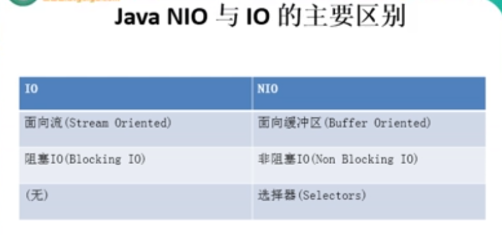
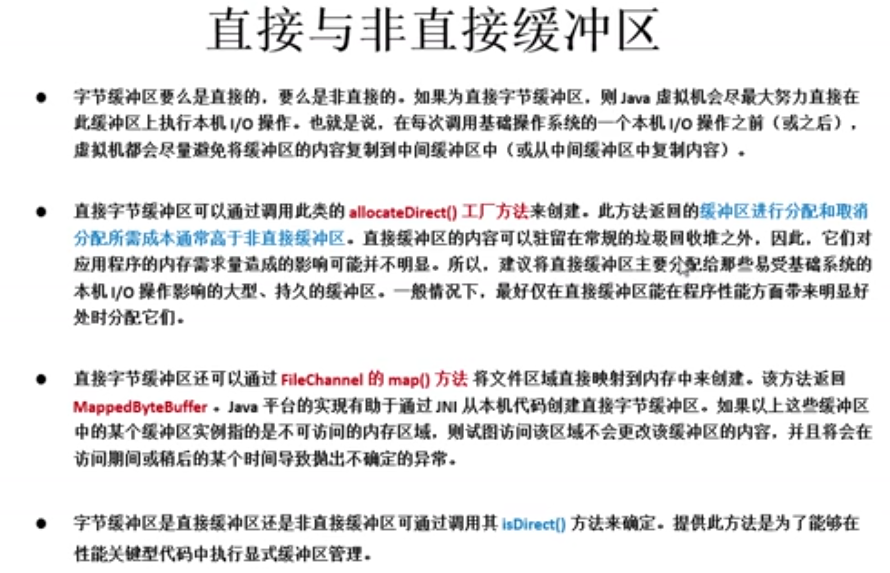
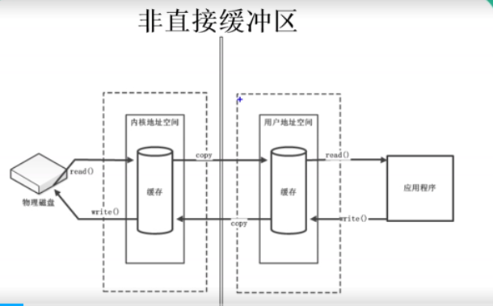
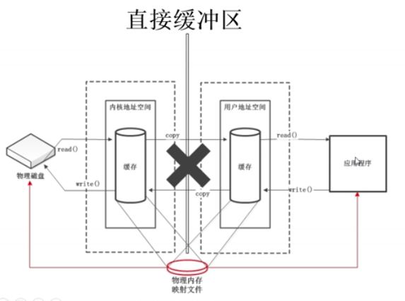

### 开始看5

<<<<<<< HEAD

=======
>>>>>>> refs/remotes/origin/master

#### 1.NIO于IO的区别

NIO的核心在于：通道（channel）和缓冲区（Buffer），通道表示打开到IO设备（例如：文件、套接字（socket））的连接。若要使用NIO，需要获取用于连接IO设备的通道以及用于容纳数据的缓冲区，然后操作缓冲区，对数据进行处理。**简而言之，Channel负责传输，Buffer负责存储数据**

#### 1.缓冲区（buffer）

​	在Java NIO中负责数据的存储。缓冲区就是数组，用于存储不同数据类型的数据。根据所存储的数据的类型不同（除Boolean外），提供了相应类型的缓冲区：

* ByteBuffer
* CharBuffer
* ShortBuffer
* IntBuffer
* LongBuffer
* FloatBuffer
* doubleBuffer

以上缓冲区都可用`allocate()`方法（非直接缓冲区）和`allocateDirect()`方法（直接缓冲区）获取。

##### 	存取数据的两个核心方法：

​		存数据：`put()`

​		取数据：`get()`

##### 	缓冲区的四个核心属性：

​		capacity：容量，表示缓冲区中最大存储数据的容量，一旦声明不可更改。

​		limit：界限，表示缓冲区中可操作数据位置的大小

​		position：位置，表示缓冲区中正在操作数据的位置

​		mark：标记，标记当前`position`的位置，使用`reset()`方法后将返回到之前标记的位置。

##### 	其他方法：

​		flip(): 取数据前需要先使用`flip()`方法切换到可读状态

​		reset():一般在`mark()`之后用，刷新`position`到`mark()`时的位置

​		clear():刷新`position`和`limit`到初始位置，注意：该方法不会清除缓冲区的内数据，只是刷新那两个指针的位置。

​		hasRemaining()：判断缓冲区中是否还有剩余可用数据，返回`Boolean`值.（依据当前`position`的位置来判断在该位置之后是否还有数据）

​		remaining()：显示缓冲区中剩余数据的个数。（也是利用`position`的位置来判断）

##### 	大小关系：0 <= mark <= position <= limit <= capacity

#### 2.直接缓冲区和非直接缓冲区

* ##### 直接缓冲区：通过allocateDirect（）创建，该缓冲区是建立在物理内存中的，有利于提高数据存取效率

* ###### 非直接缓冲区：通过allocate（）创建，该缓冲区建立在JVM内存中

  

#### 3.通道（Channel）

​	用于源节点与目标节点的连接。负责缓冲区中数据的传输，Channel本身不存储数据，需要配合缓冲区进行传输。