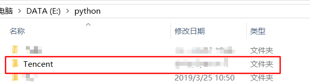

### Scrapy框架介绍

Scrapy是用纯python实现一个为了爬取网站数据、提取结构性数据而编写的应用框架，用途广泛。

### Scrapy架构


**Scheduler（调度器）** :（决定翻页）负责接受引擎发动过来的Request请求，并按照一定的方式进行整理排列、入队，当引擎需要时，还给引擎。

**Downloader（下载器）**：负责下载引擎发送的所有Request请求，并将其获取到的Response交还给引擎，并由引擎交给Spider来处理。

**Spider（爬虫）**：它负责处理所有Responses，从中分析提取数据，获取Item字段需要的数据，并将需要跟进的URL提交给引擎，再次进入Scheduler。

**Item Pipeline（管道）**：它负责处理Spider中获取到的Item，并进行后期处理（详细分析、过滤、存储等）的地方。

**Downloader Middlewares（下载器中间件）**：可自定义扩展下载功能的组件。

**Spider Middlewares（Spider 中间件）**：可自定义扩展和操作引擎和Spider之间通信的功能组件。


### Scrapy运作流程


### 制作Scrapy爬虫一共需要4步：

1. 新建项目：新建一个新的爬虫项目
2. 明确目标（编写item.py）明确你想要抓取的目标
3. 制作爬虫（XXXSpider.py）:制作爬虫开始爬取网页
4. 存储内容（pipelines.py）:设计管道存储爬取的内容


### 安装Scrapy

dos窗口 键入  `python -m pip install Scrapy`,若出现如下安装错误：


解决此错误：[点我](https://www.cnblogs.com/zfquan/p/8093297.html)


### 执行XXXSpider.py文件

1. 先抓取网页，格式 `scrapy crawl name`，执行后，网页会以自己指定的名字命名被保存到本地。

2. 再保存数据到指定文件内，格式：`scrapy crawl name -o 保存文件的形式`，`name`表示的是spider文件中的属性name的值，例如


```shell
#在dos窗口输入
scrapy crawl tianya -o test.csv  #保存为csv格式，该格式以excle打开
scrapy crawl tianya -o test.html #保存为html格式，该格式以html页面打开
scrapy crawl tianya -o test.xml  #保存为xml格式，该格式以xml文件打开
scrapy crawl tianya -o test.json #保存为json格式，该格式以json格式打开
```

*注：不能使用 `scrapy crawl name -o 保存文件的形式` 的语法来保存txt文件* 。


### 练习一(爬取腾讯招聘网页)

步骤一(dos中)：新建项目。在指定的目录下输入，格式`scrapy startproject 项目名`

```shell
scrapy startproject Tencent
```


执行后会在指定目录下生成项目文件




步骤二(IDE中)：编写item文件内容。在TencentItem类中加入所要抓取元素的描述。以下六个属性就是招聘网页的列元素

```python
class TencentItem(scrapy.Item):
    # define the fields for your item here like:
    # name = scrapy.Field()
    name = scrapy.Field()
    detailLink = scrapy.Field()
    positionInfo = scrapy.Field()
    peopleNumber = scrapy.Field()
    workLocation = scrapy.Field()
    publishTime = scrapy.Field()
    pass
```


步骤三(dos中)： 制作爬虫。进入项目目录中的`spiders`目录下，执行一下命令，生成爬虫文件。格式  `scrapy  genspider  爬虫名称  “要爬取的目标URL”`  ,注：爬虫名称不能和项目名称相同。

```shell
scrapy  genspider hrTencent "hr.tencent.com"
```

执行后


打开刚生成的 爬虫文件，修改`start_urls`的值，该值是一个list列表，第一个元素就是爬虫要第一个爬取的URL,将其修改成我们自己要爬取的第一个页面的URL。

修改前：


修改后：


然后编写`Parse`函数，这里有`单页抓取`和`多页抓取` 。

```python
# -*- coding: utf-8 -*-
import scrapy
import Tencent.items

class HrtencentSpider(scrapy.Spider):
    name = 'hrTencent'
    allowed_domains = ['hr.tencent.com']
    start_urls = ['https://hr.tencent.com/position.php?keywords=java&lid=0&tid=0']
    offset = 0
	
    #抓取单页数据
    def parse(self, response):
        for  everydata  in response.xpath("//tr[@class='even'] | //tr[@class='odd']  "):
            tencentitem= Tencent.items.TencentItem()
            tencentitem["name"] = everydata.xpath("./td[1]/a/text()").extract()
            tencentitem["detailLink"] = everydata.xpath("./td[1]/a/@href").extract()
            tencentitem["positionInfo"] = everydata.xpath("./td[2]/text()").extract()
            tencentitem["peopleNumber"] = everydata.xpath("./td[3]/text()").extract()
            tencentitem["workLocation"] = everydata.xpath("./td[4]/text()").extract()
            tencentitem["publishTime"]= everydata.xpath("./td[5]/text()").extract()
            yield  tencentitem
```

```python
# -*- coding: utf-8 -*-
import scrapy
import Tencent.items

class HrtencentSpider(scrapy.Spider):
    name = 'hrTencent'
    allowed_domains = ['hr.tencent.com']
    start_urls = ['https://hr.tencent.com/position.php?keywords=java&lid=0&tid=0']
    offset = 0  #第一页的偏移量是0

    #抓取多页数据
    def parse(self, response):
        for  everydata  in response.xpath("//tr[@class='even'] | //tr[@class='odd']  "):
            tencentitem= Tencent.items.TencentItem()
            tencentitem["name"] = everydata.xpath("./td[1]/a/text()").extract()
            tencentitem["detailLink"] = everydata.xpath("./td[1]/a/@href").extract()
            tencentitem["positionInfo"] = everydata.xpath("./td[2]/text()").extract()
            tencentitem["peopleNumber"] = everydata.xpath("./td[3]/text()").extract()
            tencentitem["workLocation"] = everydata.xpath("./td[4]/text()").extract()
            tencentitem["publishTime"]= everydata.xpath("./td[5]/text()").extract()
            yield  tencentitem

        #设置偏移量，根据每页会显示10条数据，来抓取多页数据
        if self.offset <470:
            self.offset+=10
        #通过偏移量来拼接一个新的URL
        newurl="http://hr.tencent.com/position.php?amp;start=0&a=&start="+str(self.offset)+"#a"
        yield scrapy.Request(newurl,self.parse) #翻页，自己调用自己，从而实现多页抓取。
```

步骤四：存储内容(编写pipelines文件)。

```python
class TencentPipeline(object):
    def  __init__(self):
        self.file=open("t.txt","w")   #新建一个t.txt文件，设置为可写状态。
    def __del__(self):
        self.file.close()
    def process_item(self, item, spider):
        text=str(item)+"\r\n"
        self.file.write(text)       #将item写入t.txt文件
        self.file.flush()			#刷新
        return item
```

接着去设置setting文件，将里面的ITEM_PIPELINES 注释打开，这样其实就是为了让`引擎`能够调用item pipeline 组件，从而将数据item保存到指定的txt文件中。


注：上图中的 `300` 表示的是支持300的并发。