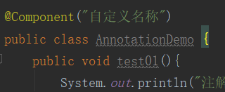
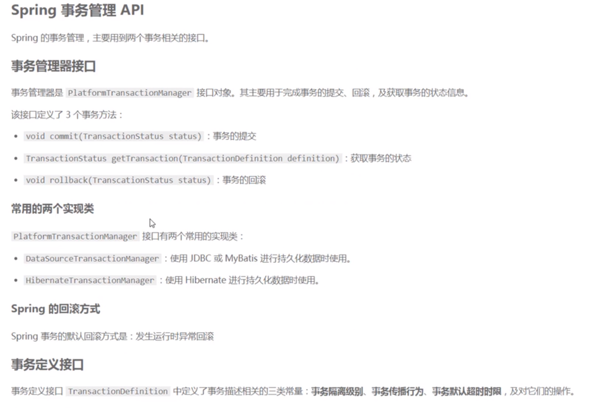

## 开始看2-11

### Spring框架Runtime(运行时)环境


由上图可看出，Spring涉及到了数据访问层和web层（controller层）以及业务层，所以能很好的和数据访问层的Mybatis以及web层的SpringMVC整合，以促进更加方便地使用Mybatis和SpringMVC。Spring在业务层上的表现是AOP和声明式事务等功能的体现。可以说Spring就是一个一站式的框架。

### Spring中需要学习的几大核心功能

IOC/DI

AOP

声明式事务


#### Spring容器继承图：


### IOC(控制反转)

* IOC完成的事情就是将原先由程序员手动new实例化对象的事情，转交给Spring负责。
* 控制反转中的控制指的是：控制类 的对象。
* 控制反转中的反转指的是：实例化对象交给Spring负责。
* IOC最大的作用就是`解耦`，程序员不需要管理对象，解除了程序员和管理对象之间的`耦合`.

### BeanFactory和ApplicationContext

ApplicationContext是BeanFactory的子接口。他们都可代表Spring容器，Spring容器是生成Bean实例的工厂，并且管理容器中的Bean。ApplicationContext在 BeanFactory 的基础上添加了其他功能，比如与 Spring 的 AOP 更容易集成，也提供了处理 message resource 的机制（用于国际化）、事件传播以及应用层的特别配置，比如针对 Web 应用的WebApplicationContext。BeanFactory 接口是 Spring IoC 容器的核心接口。

### Spring环境搭建（基于maven）

1. 创建maven项目

2. 添加Spring的核心依赖。

   要运行一个基本的Spring 必须要有的jar包有5个：`spring-beans`、`spring-core`、`spring-expression`、`spring-context`、`commons-logging`。在pom文件中添加依赖时，只要添加`spring-context`依赖即可，因为这个依赖中包含了其他几个的jar包。

3. 创建`applicationContext.xml`文件，并添加xsd约束。在IDEA中创建spring的`applicationContext.xml`时，会自动创建满足IOC所需要的基本xsd约束。

4. 到此spring环境已经搭建好，接下来就是创建JavaBean，然后就是将将写好的JavaBean配置到`applicationContext.xml`中。

5. 编写测试类，测试spring的IOC。

   ```java
   public class TestDemo {
       public static void main(String[] args) {
           //初始化spring容器
       ApplicationContext applicationContext = new ClassPathXmlApplicationContext("applicationContext.xml");
           //获取指定的容器中的对象
           People p = applicationContext.getBean("people", People.class);
   		//或是通过强转型的方式获取
           //People p = (People) applicationContext.getBean("people");
           System.out.println(p);
       }
   
   }
   ```

   运行该测试类，输出的结果为：

   

   说明此时People对象是已经被Spring容器创建了，只是我自己没有给里面的属性赋值而已，说明IOC起了作用。


### Spring容器创建对象的三种方式

1. 通过构造方法创建

   1.1 无参构造创建（默认情况）

   1.2 有参构造创建（需要明确配置）

   ​	1.2.1 需要在`JavaBean`中创建有参构造函数

   ​	1.2.2 在`bean`标签中的`constructor-arg`子标签中设置调用哪个构造方法来创建对象，				如果`JavaBean`中存在多个参数类型相同，但是顺序不同的构造函数，那么以最后的那个构造函数来创建对象。

2. 实例工厂创建（需要先创建工厂对象，通过该工厂对象来创建相应的对象。类似非静态方法需要先创建对象才能被调用）

   2.1 工厂设计模式：帮助创建对象，通过传入不同的参数来让工厂创建不同的对象。

   2.2 实现步骤：

   * 创建一个工厂类

     ```java
     public class PeopleFactory {
     	public People newInstance(){
     		return new People(1,"测试");
     	}
     }
     ```

   * 在`applicationContext.xml`中配置工厂对象和所要创建的对象（此处是People对象）

     ```xml
     <bean id="factory" class="com.bjsxt.pojo.PeopleFactory"></bean>
     <bean id="peo1" factory-bean="factory" factory-method="newInstance"></bean>
     ```

   * 最后还是使用如下的方式来获取对象

     ```java
     ApplicationContext ac = new ClassPathXmlApplicationContext("applicationContext.xml");
     		People people = ac.getBean("peo1",People.class);
     		System.out.println(people);
     ```

3. 静态工厂创建（不用创建工厂对象，即可直接通过工厂类直接创建相应的对象。类似静态方法不需要创建对象就能直接被调用）

   实现步骤：

   * 创建一个工厂类

     ```java
     public class PeopleFactory {
     	public static People newInstance(){
     		return new People(1,"测试2");
     	}
     }
     ```

   * 在`applicationContext.xml`中所要创建的对象

     ```xml
     <bean id="peo2" class="xx.xx.PeopleFactory" factory-method="newInstance"></bean>
     ```

   * 最后还是使用如下的方式来获取对象

     ```java
     ApplicationContext ac = new ClassPathXmlApplicationContext("applicationContext.xml");
     		People people = ac.getBean("peo2",People.class);
     		System.out.println(people);
     ```


### 给对象属性赋值(注入)的方式

1. 通过构造函数赋值（在`Bean`标签的`Constructor-arg`子标签中配置，前提是javaBean中要存在带参数的构造器）
2. 通过set方法赋值（在`Bean`标签的`property`子标签中配置，前提是JavaBean中存在set方法,其本质就是执行的set方法）


### DI(依赖注入)

当一个类（A）中需要另一个类(B)时，把B赋值给A的过程就叫做依赖注入。

DI和IOC其实是一回事。


### Spring整合Mybaties

待续。。。


### AOP(面向切面编程)

​	在程序原有纵向执行流程中，针对某一个或某一些方法添加通知，形成横切面过程就叫做面向切面编程。不需要修改原有程序的代码，是程序具有高扩展性。


常用概念：

- 切点(pointcut)：指的是原有的功能（方法）
- 前置通知(before advice)：在切点之前执行的功能。可以理解成在切点之前所要执行的方法
- 后置通知(after advice)：在切点执行之后的功能。可以理解成在切点之后所要执行的方法
- 异常通知(throws advice)：如果切点执行过程中出现异常，会触发异常通知
- 切面：所有功能的总称叫做切面(前置通知+切点+后置通知)
- 织入：形成切面的过程叫做织入


实现AOP的两种方式：

1. **schema-base** 方式 （每个通知需要实现特定的接口）

   **前置通知和后置通知**

   * 添加AOP所需要的依赖(在spring基础依赖的基础上)

     ```xml
     		<dependency>
                 <groupId>org.springframework</groupId>
                 <artifactId>spring-aspects</artifactId>
                 <version>4.3.18.RELEASE</version>
             </dependency>
             <dependency>
                 <groupId>org.springframework</groupId>
                 <artifactId>spring-tx</artifactId>
                 <version>4.3.18.RELEASE</version>
             </dependency>
     ```

   * 编写切点和通知类

     * 前置通知的类必须实现`MethodBeforeAdvice`接口，才能实现该通知是在切点之前执行。
     * 后置通知的类必须实现`AfterReturningAdvice`接口，才能实现该通知是在切点之后执行。

   * 编写`applicationContext.xml`配置文件

     * 添加约束

       ```xml
       xmlns:aop="http://www.springframework.org/schema/aop"
       
       http://www.springframework.org/schema/aop
       https://www.springframework.org/schema/aop/spring-aop.xsd
       ```

     * 将通知类交给Spring容器管理，然后在`<aop:config>`标签中配置切点和通知。

       

     * 编写测试类

     tips：*  表示通配符，匹配任意方法名、任意类名、任意一级包名。如希望匹配任意参数，括号里写两个点 `（..）`

   **异常通知**

   **环绕通知**（把前置通知和后置通知都写到一个通知中，就组成了环绕通知）

   * 编写通知类，实现`MethodInterceptor`接口

     

   * 配置`applicationContext.xml`配置文件，配置方式和前置通知以及后置通知一致。

   * 编写测试类

2. **aspectJ**方式（不需要实现特定的接口）

   **异常通知**

   * 编写通知类

     

   * 编写`applicationContext.xml`配置文件

     

   * 编写测试类

   tips:一般我们在service层抛出异常，不对异常进行捕获，而是在controller层或者是调用层进行处理异常。

   **前置通知、后置通知、异常通知、环绕前置通知和环绕后置通知**

   * 编写通知

     

   * 编写`applicationContext.xml`配置文件

     

3. 注解形式（基于aspectJ）

   spring要想使用注解，就必须引入`xmlns:context`这个约束.

   然后就是配置包扫描，用于扫描指定包下的所有类，这样这些类就可以通过注解被spring容器加载。

   可以说，注解就是用来代替配置文件的中的配置的。

   @Component

   相当于<bean>标签，加在类上，就相当于把这个类交给了spring容器，初始化容器时就会生成这个类的对象。`Component`注解默认生成的对象的名称是类名首字母小写。

   

打印出spring容器中所有对象可以看到，


`@Component`注解还可以自定义所生成的对象的名称，




注解方式的步骤：

   	1. 在spring配置文件中设置包扫描，使用`<context:component-scan>`标签

      ​      	2. 在类上加上`@Component`注解来配置bean，在方法上添加`@Pointcut`来定义切点
         	3. 在通知类上添加`@Component`和`@Aspect`，表示通知方法在该类中。


**静态代理**

​	优点：

​	缺点：当代理功能比较多时，代理类中需要写很多。

**动态代理**

​	为了解决静态代理频繁编写代理功能的缺点。

​	分类：

​		JDK动态代理

​		cglib动态代理

**JDK动态代理**

​	优点：JDK自带，不需要额外导入jar。

​	缺点：真实对象必须实现接口；

​	 	   利用反射机制，效率不高；


### Spring事务



1. #### 编程式事务

   

2. #### 声明式事务


### Spring常用注解

1. @Component   创建类对象，相当于配置<bean/>，一般写在数据访问层或者实际业务层的类上。
2. @Service   与@component功能相同，一般写在service层的类上。
3. @Repository   与@component功能相同，一般写在数据访问层的类上。
4. @Controller    与@component功能相同，一般写在控制器层的类上。
5. @Resource 
6. @autowired 
7. @Value    获取properties文件中的内容，一般写在类的属性字段上。
8. @Pointcut()     定义切点，一般写在切点类上。
9. @Aspect()     定义切面
10. @Before()     定义前置通知
11. @After      定义后置通知
12. @AfterReturning  定义后置通知（条件是切点必须正确执行）
13. @AfterThrowing  定义异常通知
14. @Around  定义环绕通知


### autowired 和 reaource区别


1. **主要区别就是@Autowired是默认按照类型装配的 @Resource默认是按照名称装配的**

2. @Autowired默认**按类型装配**（这个注解是属业spring的），默认情况下必须要求依赖对象必须存在，如果要允许null值，可以设置它的required属性为false。**如果我们想使用名称装配可以结合@Qualifier注解进行使用，如下**：

   ```java
   @Autowired() 
   @Qualifier("baseDao")    
   private BaseDao baseDao;
   ```

3. @Resource **是JDK1.6支持的注解**，**默认按照名称进行装配**，名称可以通过name属性进行指定，如果没有指定name属性，当注解写在字段上时，默认取字段名，按照名称查找，如果注解写在setter方法上默认取属性名进行装配。当找不到与名称匹配的bean时才按照类型进行装配。但是需要注意的是，如果name属性一旦指定，就只会按照名称进行装配。


### spring整合Web

web应用下，Spring的Bean的装配方式：

1. xml方式
2. 注解方式

- xml方式

在javaSE中（或者说只引入了spring的几个核心依赖的情况下），是利用ClassPathXmlApplicationContext或者AnnotationConfigApplicationContext来初始化容器并获取Bean，但是在Web应用中就需要通过ContextLoaderListener来加载spring-context*.xml（Bean的配置文件）文件，从而实现Spring容器的初始化。然后编写配置类来获取容器中的Bean。

配置类需要实现ApplicationContextAware接口和Disposable接口。当系统启动的时候，先加载Web.xml文件，然后通过ContextLoaderListener去加载其中的spring-context*.xml（Bean的配置文件），初始化ApplicationContext ，然后Spring再去调用实现了ApplicationContextAware接口的配置类中的setApplicationContext(ApplicationContext applicationContext )方法。将刚才初始化的ApplicationContext 传进去进行属性赋值 ，最后开一个公共的方法来供外部获取Bean就行了。

配置类如下：


**个人结论：说到底，ContextLoaderListener其实就相当于作为一个中转站或者说代理，间接的提供获取Spring容器中的Bean**


添加依赖：


web.xml:


- 注解方式

在Spring-context.xml文件中添加配置：


### Spring整合SpringMVC

添加依赖：


配置web.xml文件：

- 配置过滤器

  

- 配置DispacherServlet

  

配置spring-mvc.xml文件：


### SpringMVC拦截器


创建springMVC拦截器：


在spring-mvc.xml中配置拦截器：


exclude-mapping：表示指定路径下的资源不会被拦截


### SpringMVC 源码解析


### spring整合Druid（一种效率很高的数据库连接池）

添加`Druid`和`数据库驱动`依赖：


添加`properties文件`：


添加spring-context-druid文件，开始整合Druid:


配置Druid监控中心：

Druid提供了大量的监控数据，只需要在`web.xml`种配置一个servlet就可以方便的查看这些信息。


查看Druid监控中心的前提是，数据库链接正常，启动项目后，访问/druid即可。如下图：


### spring整合mybatis

添加依赖：


添加`mybatis-config.xml`文件：


添加`spring-mybatis-config.xml`文件：


