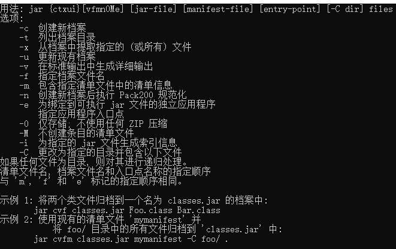
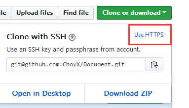

### 1.将文件打成jar包

```sh
jar -cvf testjar.jar ./cn
```


注释：testjar.jar是要创建的jar包的名称 ，    ./ 表示当前目录，cn是该目录中的一个文件夹名，该文件夹内可以随意存放内容（一般是java文件和class文件）。

执行：


打包后的结果如图：





#### 2.创建Git的SSH密钥

1. ##### 输入ssh-keygen

2. ##### 根据提示敲几个回车就行

3. ##### 找到上面提示的id_rsa.pub文件

4. ##### 打开id_rsa.pub文件，复制里面的全部内容

5. ##### 进入Github，再进入setting设置里面

6. ##### 选择SSH and GPG keys

7. ##### 将刚才复制的内容粘贴到  key 中，Title可以随便起一个名字。

8. ##### 切换Clone or download 方式，默认为HTTPS，将其切换成SSH方式即可。

   

9. ##### 有了SSH之后，每次push文件的时候就可以不用输入github的用户名和密码了。

#### 3.查看相关端口

例子：

```shell
netstat -ano|findstr "8080"
```


#### 4.[超链接测试](http://www.baidu.com)


#### 5.IDEA批量修改快捷键（Shift+F6）

* 先选中要修改的名称，然后再Shift+F6，继续修改就行。


#### 6.编码规范

1. 注释和代码不要在同一行
