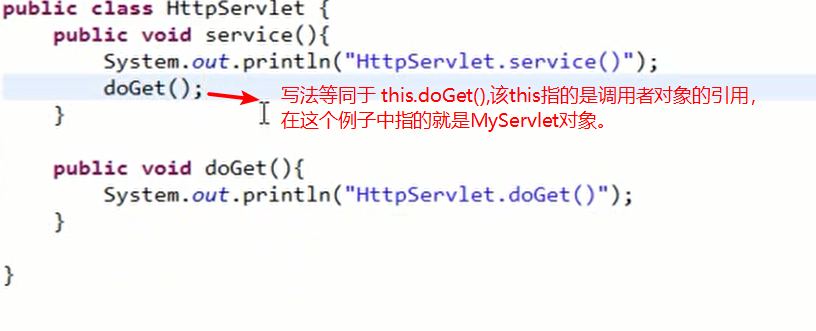
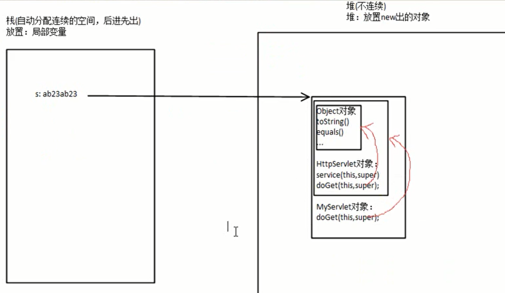

### java中位运算^,&,<<,>>,<<<,>>>总结

**1.^(亦或运算) ，**针对二进制，相同的为0，不同的为1

例子:2^3

```java
2 =======>0010
3 =======>0011
结果是 0001 ，十进制即为 1
```


**2.&（与运算）** 针对二进制，只要有一个为0，就为0。除了`按位与运算`，还有一个作用就是 `长路与`  ，指在&的两边的表达式都要被执行，与&&(短路与)的区别就是短路与是只要有一边是false,那么另外一边的表达式就不会被执行。

例子：2&3

```java
2 =======>0010
3 =======>0011
结果是 0010 ，十进制即为 2
```


**3.<<(向左位移)** 针对二进制，转换成二进制后向左移动3位，后面用0补齐

例子：2<<3   (将2向左移动3位)

```java
2 =======>0000 0010
向左移动3位后：
  =======>0001 0000
 十进制即为：16
```


**4.>>(向右位移)** 针对二进制，转换成二进制后向右移动3位

例子：2>>3 (将2向右移动3位)

```java
2 =======>0000 0010
向右移动3位后：
  =======>0000 0000
即为： 0
```


**5.>>>(无符号右移)**  无符号右移，忽略符号位，空位都以0补齐，**在计算机中负数采用二进制的补码表示，10进制转为二进制得到的是源码，将源码按位取反得到的是反码，反码加1得到补码**，在转换过程中，最高位就是符号位，0表示正，1表示负。>>>与>>唯一的不同是它无论原来的最左边是什么数，统统都用0填充。**比如，byte是8位的，-1表示为byte型是11111111(补码表示法）**


正数做>>>运算的时候和>>是一样的。区别在于负数运算。

例1：16>>>2

注：16是int型，是4字节32位，又因为是正数，所以前面的24位都是0，省略没写而已。

```java
16 =======>0001 0000   
向右无符号右移2位后：
   =======>0000 0100
十进制即为：4
```

例2：-16>>>2

```java
16 =======>0000 0000 0000 0000 0000 0000 0001 0000
按位取反后：
   =======>1111 1111 1111 1111 1111 1111 1110 1111
再加1：（此时为-16）
   =======>1111 1111 1111 1111 1111 1111 1111 0000
最后右移2位：
   =======>0011 1111 1111 1111 1111 1111 1111 1100
十进制即为：1073741820
```


### 方法的重载和重写

**重载**：定义：Java的方法重载，就是在类中可以创建多个方法，它们可以有相同的名字，但**必须具有不同的参数，即或者是参数的个数不同，或者是参数的类型不同**。调用方法时通过传递给它们的不同个数和类型的参数来决定具体使用哪个方法。

**注**：方法重载是不考虑方法返回类型和参数名称的。比如以下：

```java
1.  public void aMethod(int a,int b){}
2.  public String  aMethod(String b,String c){}
3.  public int  aMethod(int b,int c){}
```

上面的三个方法中，1和2是方法重载，2和3是方法重载,而1和3不是方法重载 


**重写：**子类可继承父类中的方法，而不需要重新编写相同的方法。但有时子类并不想原封不动地继承父类的方法，而是想作一定的修改，这就需要采用方法的重写。方法重写又称方法覆盖。

​	若子类中的方法与父类中的某一方法具有相同的方法名、返回类型和参数表，则新方法将覆盖原有的方法。 如需父类中原有的方法，可使用super关键字，该关键字引用了当前类的父类。

**特性**：

关于方法重写的一些特性：

1.发生方法重写的两个方法返回值、方法名、参数列表必须完全一致(子类重写父类的方法)

2.子类抛出的异常下不能超过父类相应方法抛出的异常(子类异常不能大于父类异常)

3.子类方法的访问级别不能低于父类相应方法的访问级别(子类访问级别不能低于父类访问级别)

根据2，3条可以确定第一条，子类重写父类方法的返回值类型不能大于父类方法的返回值类型，即是说子类方法的返回值必须和父类方法的返回值相同或是其子类。

**注**：方法重写与方法重载不同，方法的重载是方法的参数个数或类型不同，方法名相同。方法重写是要注意权限的问题，子类中的权限不能小于父类的权限，当父类的权限为private时，子类无法继承。也就无法产生所谓的重写。（修饰符高低：private < 默认修饰符 <protected< public）


### 抽象类

含有抽象方法的类称为抽象类，不能生成对象，即不能被new ,只能被继承；

抽象类当中可以存在非抽象的方法（普通方法）、成员变量、构造方法；


### 接口

​	Java接口本身没有任何实现，因为Java接口不涉及表象，而只描述public行为，所以Java接口比Java抽象类更抽象化。但是接口不是类，不能使用new 运算符实例化一个接口。Java接口的方法只能是抽象的和公开的，**Java接口不能有构造器**，*Java接口可以有public、static和final属性。即接口中的属性可以定义为 public static final int value=5;*

**java中类是单继承，多实现的，接口可以多继承。**


### 集合（容器）

#### 1.Collection:

* List(有序，可重复，遍历方式：for、iterator)
  * ArrayList 底层用数组实现。线程不安全，查询效率高。
  * LinkList 底层用双向链表实现。线程不安全，插入、删除的效率高。
* Set (无序，不可重复，遍历方式：foreach、iterator)
  * HashSet 内部用HashMap实现

#### 2.Map(键值对形式)

* HashMap 线程不安全，效率高
* HashTable 线程安全，效率低


### Java变量的自动类型转换和强制转换

数据类型的转换，分为自动转换和强制转换。自动转换是程序在执行过程中“悄然”进行的转换，不需要用户提前声明，一般是从位数低的类型向位数高的类型转换;强制类型转换则必须在代码中声明，转换顺序不受限制。

##### 自动数据类型转换

　自动转换按从低到高的顺序转换。不同类型数据间的优先关系如下：

​    低--------------------------------------------->高

​     byte,short,char-> int -> long -> float -> double


##### 强制数据类型转换

​    强制转换的格式是在需要转型的数据前加上“( )”，然后在括号内加入需要转化的数据类型。有的数          		  据经过转型运算后，精度会丢失，而有的会更加精确。


### 对象的内存解析

​	栈内存（stack）：存放局部变量和引用。

​	特点：

​		 

​	

​	堆内存（heap）：存放new出来的对象，包括该对象中的成员变量


​	


​	方法区：存在于堆内存中，又叫静态区。用于存放类信息（class对象）、静态变量、静态方法、字符串常量等。


内存分析图：


### 成员变量和局部变量

##### 成员变量

内存空间位置：堆空间

书写位置：类的内部，方法的外部。在未赋值时，默认是有值的，不同的数据类型会有不同的初值，	 如下：

​	byte   short   int    long   ===>    0

​	float   double   ===>    0.0

​	char   ====>  空格

​	boolean ===> false

​	引用类型变量 ===> null

##### 局部变量

内存空间位置：栈空间

书写位置：方法的内部、方法参数(形参)、代码块内。在声明局部变量时必须为其赋初值，不然会报错。


*注：一个class文件内可以有多个类，但有且只能有一个public类*


### 构造器（构造方法）

要点：

1.通过new关键字调用。

2.调用构造器时虽然有返回值(返回对象)，但是在定义时却不能在构造器中使用return来返回某个值，可以是 `return;`   因为这样代表方法执行结束。

3.如果没有自定义构造器，那么	编译器会自动添加一个无参的构造器，如果已定义，则编译器不会自动添加。

4.构造器的方法名必须和类名一致。


### this关键字

定义：this指的是当前对象的引用

常见的用法以及注意事项：

​	1.使用this来调用当前类的属性，例：`this.name=name;`

​	1.使用this关键字调用其他重载的构造方法（构造器间的相互调用），`this([形参1],[形参2]，..)`,this必须放在构造器的第一行。

​	2.this不用于static方法中。


### static关键字

static修饰的成员变量和方法从属于类，普通变量和方法从属于对象。

注意事项：非静态方法中可以调用静态方法，而静态方法中不能调用非静态方法。

原因（结合内存分析图来思考更容易理解）：

​	非静态方法存在于对象中，静态方法存在于方法区中，对象的创建是在类被加载之后。所以，在之后创建的可以调用一开始被加载的，但是一开始被加载的却不能调用在它之后创建的。


### equals方法和==  以及String

String要点：

* String的内部其实是通过字符数组来存储的。
* String是不可变字符序列，原因是在其源码中的value字符数组是`private final`修饰的。
* 不能被其他类继承，因为String是以`final`修饰的。

String对象的创建方式：

```java
方式一：通过 new 关键字
String str1 = new String("aa") //这样其实在内存中是创建了两个对象，一个是通过 new 出来的，存在堆中，该对象的值是引用的方法区中的“aa”。而另一个就是方法区中的 “aa”，这同样是一个对象。
方式二：直接赋值
String str2 = "aa"  //在方法区中创建一个”aa“对象
```


在Object类中的equals方法的实现其实就是根据 == 来判断当前对象和所传入的对象是否相同，具体实现如下：

```java
#Object类中的equals方法的实现
public boolean equals(Object obj){
    return (this == obj);
}
```

而在String类中，是通过重写Object中的equals方法来实现对字符串内容的比较。

```java
#String类中的equals方法
public boolean equals(Object anObject){
    if(this == anObject){
        return true;
    }
    if(anObject instanceof String){
        String anotherString = (String)anObject;
        int n = value.length;
        if(n == anotherString.value.length){
            char v1[] = value;
            char v2[] = anotherString.value;
            int i = 0;
            while(n--！=0){
                if(v1[i]!=v2[i])
                    return false;
                i++;
        	}
        	return true;
    	}
  	}
  	return false;
}
```

例子：

```java
public class Test {
	
	public static void main(String[] args){
		
		String str1 = "abc";
		String str2 = "abc";
		String str3 = new String("abc");
		String str4 = new String("abc");
		
		System.out.println(str1 == str2);           //true
		System.out.println(str1 == str3);           //false
		System.out.println(str3 == str4);           //false
		System.out.println(str3.equals(str4));      //true
	} 
}
```

`str1、str2、str3、str4`的创建流程：

在执行`String  str1 = "abc"`的时候，JVM会首先检查字符串常量池中是否已经存在该字符串对象，如果已经存在，那么就不会再创建了，直接返回该字符串在字符串在字符串常量池中的内存地址；如果该字符串还不存在字符串常量池中，那么就会在字符串常量池中创建该字符串对象，然后再返回。所以在执行`String  str2 = "abc"`的时候，因为字符串常量池中已经存在`“abc”`字符串对象了，就不会在字符串常量池中再次创建了，所以栈内存中`str1`和`str2`的内存地址都是指向`"abc"`在字符串常量池中的位置，所以`str1 = str2`的运行结果为`true`。

而在执行`String  str3 = new  String("abc")`的时候，JVM会首先检查字符串常量池中是否已经存在`“abc”`字符串，如果已经存在，则不会在字符串常量池中再创建了；如果不存在，则就会在字符串常量池中创建`"abc"`字符串对象，然后再到堆内存中再创建一份字符串对象，把字符串常量池中的"abc"字符串内容拷贝到内存中的字符串对象中，然后返回堆内存中该字符串的内存地址，即栈内存中存储的地址是堆内存中对象的内存地址。`String  str4 = new  String("abc")`是在堆内存中又创建了一个对象，所以`str 3 == str4`运行的结果是`false`。


### super关键字

super是直接父类对象的引用。可以通过super来访问父类中被子类覆盖的方法或属性。

注意：构造方法的第一句总是`super();`也就是在第一行默认调用父类的无参构造器。构造方法的调用顺序：先追溯到object,然后再依次向下执行类的构造方法，直到当前子类	为止。*静态代码块的调用顺序也是一样*。

还有一点也至关重要，当父类中有带参构造器，无空参构造，且子类中没有明确指出使用父类带参构造生成父类对象时，程序会默认使用super()空参构造生成父类对象，此时程序会报错。原因很简单：当一个类手动加入了带参构造器，系统将不会再为你自动生成空参构造。这时就需要我们为父类添加空参构造。

*this()和super()都指的是对象，所以，均不可以在static环境中使用。*


### 构造器中不能同时显式存在this()和super()

它们俩个都要求放在首行，所有不能同时使用。

当构造器中有this()时，就会先进行同类构造器间的调用，如果没有this()时，就会默认有一个隐式super(),对上级父类构造器调用。


### 权限访问修饰符


1.private表示私有，只有本类可以访问。

2.default表示没有修饰符修饰，只有同一个包中的类能访问。

3.protected表示可以被同一个包的类以及其他包中的子类访问。

4.public表示可以被该项目的所有包中的所有类访问。


### 多态

要点：

1.多态是方法的多态，不是属性的多态（多态与属性无关）

2.多态的3个必要条件：继承、方法重写、父类引用指向子类对象

3.父类引用指向子类对象后，用该父类引用调用子类重写的方法，此时多态就出现了，若此时想调用子类的其他非重写方法则会报错。








### final关键字

1.修饰变量：被它修饰的变量不可改变。一旦赋了初值，就不能被重新赋值。

2.修饰方法：该方法不可被子类重写，但是可以被重载。

3.修饰类：修饰的类不能被继承。比如Math、String。


### 数组

数组变量属于引用类型，数组也是对象，数组中的每个元素相当于该对象的成员变量。

数组的三种初始化方式：

​	静态初始化：例如`int[] a = {2,3,4,5}`

​	动态初始化：例如，

```java
int[] a1 = new int[2];//动态初始化数组，先分配空间
a1[0] = 1;//给数组元素赋值
a1[1] = 2;
```

​	默认初始化：默认初始化就是在为数组分配空间时，根据数组类型默认给每个元素赋初值。


### 数组的遍历

for ：可循环遍历，可修改

foreach ：只可循环遍历


### 关于继承时的隐式参数（this，super）

每个方法（函数）都有两个隐式参数，分别是this和super，this表示当前对象的引用，super表示默认会调用父类的无参构造器。


### 抽象类

抽象方法的意义：将方法的设计和实现分离。


### 接口

注：接口比抽象类还要抽象，可以更加规范的对子类进行约束。其意义也在于将方法的设计和实现分离

要点：

* 接口不能创建实例，但是可以用于声明引用类型变量。
* 接口中定义的常量在编译时总是`public static final`修饰的，不管在定义的时候有没有加上该修饰，如果没有加，那么编译器在编译时会自动加上。
* 一个类实现了接口，必须实现接口中的所有方法。
* 接口中的方法必须是public abstract 修饰的，如果不写，默认是public abstract。
* 只存在常量和抽象方法
* 接口支持多继承。


### 模板方法模式（等同于Callback(回调)/Hook(钩子)）

核心思想：多态和接口的运用。


### StringBuilder

要点：

* 可变字符序列
* 线程不安全，效率高。
* 底层也是由一个字符数组来实现存储
* `new StringBuilder()` 该方式创建的StringBuilder默认大小是16（字符数组长度）
* `new StringBuilder(String/CharSequence)` 该方式创建的StringBuilder大小是`String或者CharSequence的长度+16`
* `new StringBuilder(capacity)`创建指定容量大小的StringBuilder
* 若在添加数据时所要添加的数据量超过String Builder指定的容量大小，则StringBuilder会自动扩充容量，扩充到 `原本容量*2+2` 。其扩充原理是创建一个容量为`原本容量*2+2` 的原数组副本(原数组中的内容会拷贝到副本数组中)，然后将原来数组的引用指向这个副本数组。

append()方法：源码中该方法返回一个StringBuilder的引用(this。所以在使用该方法时，可以使用方法链的形式。

`方法链`例子如下:

```java
StringBuilder sb = new StringBuilder();
sb.append(2).append("方fa链").append(true).append(3); 
System.out.println(sb);     //结果为 2方法链true3
```


### StringBuffer

要点：

* 线程安全的可变字符序列（StringBuffer内部的方法都是由synchronized修饰的）
* StringBuilder和StringBuffer的使用方式是一样的