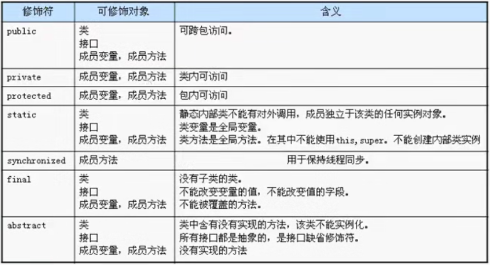
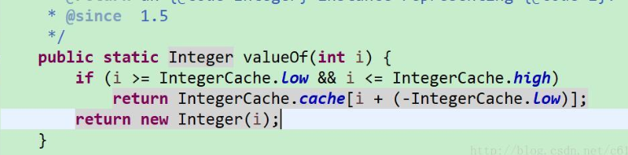
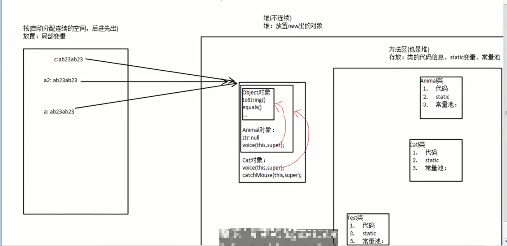
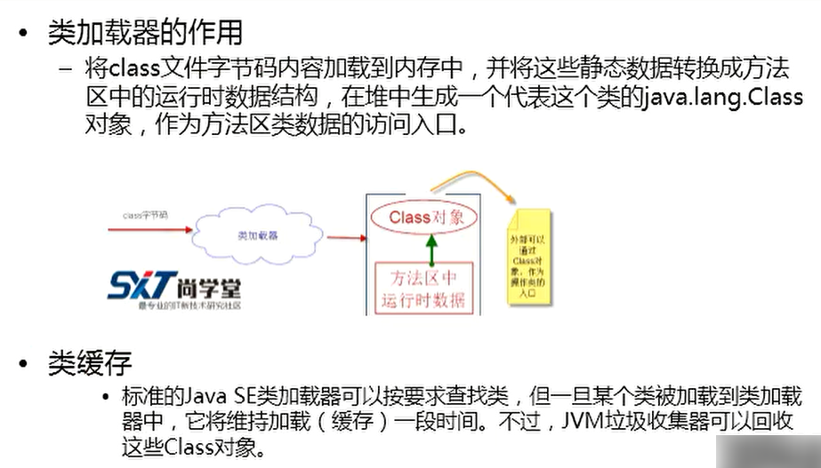

### java中位运算^,&,<<,>>,<<<,>>>总结

**1.^(亦或运算) ，**针对二进制，相同的为0，不同的为1

例子:2^3

```java
2 =======>0010
3 =======>0011
结果是 0001 ，十进制即为 1
```


**2.&（与运算）** 针对二进制，只要有一个为0，就为0。除了`按位与运算`，还有一个作用就是 `长路与`  ，指在&的两边的表达式都要被执行，与&&(短路与)的区别就是短路与是只要有一边是false,那么另外一边的表达式就不会被执行。

例子：2&3

```java
2 =======>0010
3 =======>0011
结果是 0010 ，十进制即为 2
```


**3.<<(向左位移，每移动一位乘以2)** 针对二进制，转换成二进制后向左移动3位，后面用0补齐

例子：2<<3   (将2向左移动3位)

```java
2 =======>0000 0010
向左移动3位后：
  =======>0001 0000
 十进制即为：16
```


**4.>>(向右位移，每移动一位除以2)** 针对二进制，转换成二进制后向右移动3位

例子：2>>3 (将2向右移动3位)

```java
2 =======>0000 0010
向右移动3位后：
  =======>0000 0000
即为： 0
```


**5.>>>(无符号右移)**  无符号右移，忽略符号位，空位都以0补齐，**在计算机中负数采用二进制的补码表示，10进制转为二进制得到的是源码，将源码按位取反得到的是反码，反码加1得到补码**，在转换过程中，最高位就是符号位，0表示正，1表示负。>>>与>>唯一的不同是它无论原来的最左边是什么数，统统都用0填充。**比如，byte是8位的，-1表示为byte型是11111111(补码表示法）**


正数做>>>运算的时候和>>是一样的。区别在于负数运算。

例1：16>>>2

注：16是int型，是4字节32位，又因为是正数，所以前面的24位都是0，省略没写而已。

```java
16 =======>0001 0000   
向右无符号右移2位后：
   =======>0000 0100
十进制即为：4
```

例2：-16>>>2

```java
16 =======>0000 0000 0000 0000 0000 0000 0001 0000
按位取反后：
   =======>1111 1111 1111 1111 1111 1111 1110 1111
再加1：（此时为-16）
   =======>1111 1111 1111 1111 1111 1111 1111 0000
最后右移2位：
   =======>0011 1111 1111 1111 1111 1111 1111 1100
十进制即为：1073741820
```


### 方法的重载和重写

**重载**：定义：Java的方法重载，就是在类中可以创建多个方法，它们可以有相同的名字，但**必须具有不同的参数，即或者是参数的个数不同，或者是参数的类型不同**。调用方法时通过传递给它们的不同个数和类型的参数来决定具体使用哪个方法。

**注**：方法重载是不考虑方法返回类型和参数名称的。比如以下：

```java
1.  public void aMethod(int a,int b){}
2.  public String  aMethod(String b,String c){}
3.  public int  aMethod(int b,int c){}
```

上面的三个方法中，1和2是方法重载，2和3是方法重载,而1和3不是方法重载 


**重写：**子类可继承父类中的方法，而不需要重新编写相同的方法。但有时子类并不想原封不动地继承父类的方法，而是想作一定的修改，这就需要采用方法的重写。方法重写又称方法覆盖。

​	若子类中的方法与父类中的某一方法具有相同的方法名、返回类型和参数表，则新方法将覆盖原有的方法。 如需父类中原有的方法，可使用super关键字，该关键字引用了当前类的父类。

**特性**：

关于方法重写的一些特性：

1.发生方法重写的两个方法返回值、方法名、参数列表必须完全一致(子类重写父类的方法)

2.子类抛出的异常下不能超过父类相应方法抛出的异常(子类异常不能大于父类异常)

3.子类方法的访问级别不能低于父类相应方法的访问级别(子类访问级别不能低于父类访问级别)

根据2，3条可以确定第一条，子类重写父类方法的返回值类型不能大于父类方法的返回值类型，即是说子类方法的返回值必须和父类方法的返回值相同或是其子类。

**注**：方法重写与方法重载不同，方法的重载是方法的参数个数或类型不同，方法名相同。方法重写是要注意权限的问题，子类中的权限不能小于父类的权限，当父类的权限为private时，子类无法继承。也就无法产生所谓的重写。（修饰符高低：private < 默认修饰符 <protected< public）


### 修饰符




### 抽象类

含有抽象方法的类称为抽象类，不能生成对象，即不能被new ,只能被继承；

抽象类当中可以存在非抽象的方法（普通方法）、成员变量、构造方法；


### 接口

​	Java接口本身没有任何实现，因为Java接口不涉及表象，而只描述public行为，所以Java接口比Java抽象类更抽象化。但是接口不是类，不能使用new 运算符实例化一个接口。Java接口的方法只能是抽象的和公开的，**Java接口不能有构造器**，*Java接口可以有public、static和final属性。即接口中的属性可以定义为 public static final int value=5;*

**java中类是单继承，多实现的，接口可以多继承。**


### 集合（容器）

#### 1.Collection:

* List(有序，可重复，遍历方式：for、iterator)
  * ArrayList 底层用数组实现。线程不安全，查询效率高。
  * LinkList 底层用双向链表实现。线程不安全，插入、删除的效率高。
* Set (无序，不可重复，遍历方式：foreach、iterator)
  * HashSet 内部用HashMap实现

#### 2.Map(键值对形式)

* HashMap 线程不安全，效率高
* HashTable 线程安全，效率低


### Java变量的自动类型转换和强制转换

数据类型的转换，分为自动转换和强制转换。自动转换是程序在执行过程中“悄然”进行的转换，不需要用户提前声明，一般是从位数低的类型向位数高的类型转换;强制类型转换则必须在代码中声明，转换顺序不受限制。

##### 自动数据类型转换

　自动转换按从低到高的顺序转换。不同类型数据间的优先关系如下：

​    低--------------------------------------------->高

​     byte,short,char-> int -> long -> float -> double


##### 强制数据类型转换

​    强制转换的格式是在需要转型的数据前加上“( )”，然后在括号内加入需要转化的数据类型。有的数          		  据经过转型运算后，精度会丢失，而有的会更加精确。


### JVM内存区域


运行时常量池所存放的是一些常量，例如：类名、方法名、参数名、变量名、字符串、数字等。


### 对象的内存解析

​	栈内存（stack）：存放局部变量和引用。

​	特点：

​		 

​	

​	堆内存（heap）：存放new出来的对象，包括该对象中的成员变量


​	


​	方法区：存在于堆内存中，又叫静态区。用于存放类信息（class对象）、静态变量、静态方法、字符串常量等。


内存分析图：


### 成员变量和局部变量

##### 成员变量

内存空间位置：堆空间

书写位置：类的内部，方法的外部。在未赋值时，默认是有值的，不同的数据类型会有不同的初值，	 如下：

​	byte   short   int    long   ===>    0

​	float   double   ===>    0.0

​	char   ====>  空格

​	boolean ===> false

​	引用类型变量 ===> null

##### 局部变量

内存空间位置：栈空间

书写位置：方法的内部、方法参数(形参)、代码块内。在声明局部变量时必须为其赋初值，不然会报错。


*注：一个class文件内可以有多个类，但有且只能有一个public类*


### 构造器（构造方法）

要点：

1.通过new关键字调用。

2.调用构造器时虽然有返回值(返回对象)，但是在定义时却不能在构造器中使用return来返回某个值，可以是 `return;`   因为这样代表方法执行结束。

3.如果没有自定义构造器，那么	编译器会自动添加一个无参的构造器，如果已定义，则编译器不会自动添加。

4.构造器的方法名必须和类名一致。


### this关键字

定义：this指的是当前对象的引用

常见的用法以及注意事项：

​	1.使用this来调用当前类的属性，例：`this.name=name;`

​	1.使用this关键字调用其他重载的构造方法（构造器间的相互调用），`this([形参1],[形参2]，..)`,this必须放在构造器的第一行。

​	2.this不用于static方法中。


### static关键字

static修饰的成员变量和方法从属于类，普通变量和方法从属于对象。

注意事项：非静态方法中可以调用静态方法，而静态方法中不能调用非静态方法。

原因（结合内存分析图来思考更容易理解）：

​	非静态方法存在于对象中，静态方法存在于方法区中，对象的创建是在类被加载之后。所以，在之后创建的可以调用一开始被加载的，但是一开始被加载的却不能调用在它之后创建的。


### equals方法和==  以及String

String要点：

* String的内部其实是通过字符数组来存储的。
* String是不可变字符序列，原因是在其源码中的value字符数组是`private final`修饰的。
* 不能被其他类继承，因为String是以`final`修饰的。

String对象的创建方式：

```java
方式一：通过 new 关键字
String str1 = new String("aa") //这样其实在内存中是创建了两个对象，一个是通过 new 出来的，存在堆中，该对象的值是引用的方法区中的“aa”。而另一个就是方法区中的 “aa”，这同样是一个对象。
方式二：直接赋值
String str2 = "aa"  //在方法区中创建一个”aa“对象
```


在Object类中的equals方法的实现其实就是根据 == 来判断当前对象和所传入的对象是否相同，具体实现如下：

```java
#Object类中的equals方法的实现
public boolean equals(Object obj){
    return (this == obj);
}
```

而在String类中，是通过重写Object中的equals方法来实现对字符串内容的比较。

```java
#String类中的equals方法
public boolean equals(Object anObject){
    if(this == anObject){
        return true;
    }
    if(anObject instanceof String){
        String anotherString = (String)anObject;
        int n = value.length;
        if(n == anotherString.value.length){
            char v1[] = value;
            char v2[] = anotherString.value;
            int i = 0;
            while(n--！=0){
                if(v1[i]!=v2[i])
                    return false;
                i++;
        	}
        	return true;
    	}
  	}
  	return false;
}
```

例子：

```java
public class Test {
	
	public static void main(String[] args){
		
		String str1 = "abc";
		String str2 = "abc";
		String str3 = new String("abc");
		String str4 = new String("abc");
		
		System.out.println(str1 == str2);           //true
		System.out.println(str1 == str3);           //false
		System.out.println(str3 == str4);           //false
		System.out.println(str3.equals(str4));      //true
	} 
}
```

`str1、str2、str3、str4`的创建流程：

在执行`String  str1 = "abc"`的时候，JVM会首先检查字符串常量池中是否已经存在该字符串对象，如果已经存在，那么就不会再创建了，直接返回该字符串在字符串在字符串常量池中的内存地址；如果该字符串还不存在字符串常量池中，那么就会在字符串常量池中创建该字符串对象，然后再返回。所以在执行`String  str2 = "abc"`的时候，因为字符串常量池中已经存在`“abc”`字符串对象了，就不会在字符串常量池中再次创建了，所以栈内存中`str1`和`str2`的内存地址都是指向`"abc"`在字符串常量池中的位置，所以`str1 = str2`的运行结果为`true`。

而在执行`String  str3 = new  String("abc")`的时候，JVM会首先检查字符串常量池中是否已经存在`“abc”`字符串，如果已经存在，则不会在字符串常量池中再创建了；如果不存在，则就会在字符串常量池中创建`"abc"`字符串对象，然后再到堆内存中再创建一份字符串对象，把字符串常量池中的"abc"字符串内容拷贝到内存中的字符串对象中，然后返回堆内存中该字符串的内存地址，即栈内存中存储的地址是堆内存中对象的内存地址。`String  str4 = new  String("abc")`是在堆内存中又创建了一个对象，所以`str 3 == str4`运行的结果是`false`。


### equals、hashcode、==

如果两个对象`equals`相等的话，那么它们的`hashcode`必定相等，反之则不一定相等。

若果两个对象 `== `是true，那么它们`equals`也是true，`hashcode`也是同一个。拿`包装类`或`String`来说，它们的`equals`方法的底层实现都是先判断是否 `==`，再去判断内容是否相等。


### 包装类和基本数据类型的比较（==）

以代码为例：

```java
int num1 = 127;
Integer num2 = 127;
Integer num3 = num1;
Integer num4 = 128;
Integer num5 = 128;
int num6 = 128;
System.out.println("num1 == num2 的结果为："+(num1 == num2));
System.out.println("num2 == num3 的结果为："+(num2 == num3));
System.out.println("num4 == num5 的结果为："+(num4 == num5));
System.out.println("num5 == num6 的结果为："+(num5 == num6));

```

结果为：

```
num1 == num2 的结果为：true
num2 == num3 的结果为：true
num4 == num5 的结果为：false
num5 == num6 的结果为：true
```

结果分析：

num1 == num2 的结果为：true，可见Integer对象和int数据类型比较，只要数值相同，==比较的结果为true；**其比较原理为：先将num2对象调用其intValue方法拆箱成基本数据类型int，然后在用拆箱后的int类型的值和num1比较，故其结果为true；**另：其几种类型和其封装类比较亦是如此；

num2 == num3 的结果为：true，这可能会奇怪，这个明明是两个对象的比较，怎么会true呢，其实这个是Integer的缓存原因，在Integer num2 = 127;这句代码赋值中，前面定义的是封装类声明，而后面是基本数据类型int的值，按理说是会报错的，但java有自己的自动拆箱（unboxing）&自动装箱(boxing)机制，此时会将后面的int基本数据类型装箱封装成Integer对象，而装箱调用的是Integer.valueOf(int i)方法，说了这么多终于说到重点了，缓存就是在valueOf这个方法中的，让我们先看这段代码：



当i的值在low和high之间时，是不创建对象的，直接在缓存中取，这里low为-128，high为127，即当int值为-128~127之间时，自动装箱时，是不创建对象的，直接从缓存中获取，因为num2和num3在自动装箱时均是在缓存中获取的，故均为同一个对象，所以同对象相比较当然是true了；其它封装类的比较亦是如此（Double和Float除外，这两个没有缓存）

num4 == num5 的结果为：false，经过上述2中的解释，这个结果的原因就显然易得了，因为128不在缓存的范围内，所以各自创建了对象，不同对象相比较，结果为false；

num5 == num6 的结果为：true，此为验证int和Integer值相同相比较是否受缓存限制，结果为true，显然是不受的，，但此步有点鸡肋了，细想这个的1中已经解释清楚了，是拆箱，拆箱后就都是基本数据类型了；


###  Long和int的比较

关于Long和long的比较久不在赘述了，其相关比较和上面的相似

关于Long和int，以代码为例：

```java
Long lon = 130L;
int in = 130;
System.out.println("lon == in 的结果为："+(lon == in));
```

结果为：

```
lon == in 的结果为：true
```

结果分析：

其实这个也很好理解，，只是在其中多了个基本数据类型的隐式转换，先是将Long对象拆箱为long基本数据类型，然后in会隐式转换为long，然后比较，所以结果为true；

这里不单单是Long和int，只要是封装类和基本数据类型相比较，只要实际值相同，结果一般都应为true(Boolean 除外)；

### 隐式转换

由低—>高，可以隐式自动转换，数据类型将自动提升。
其转换顺序为：
byte—>short—>int—>long—>float—>double
char–>int—>long—>float—>double


### super关键字

super是直接父类对象的引用。可以通过super来访问父类中被子类覆盖的方法或属性。

注意：构造方法的第一句总是`super();`也就是在第一行默认调用父类的无参构造器。构造方法的调用顺序：先追溯到object,然后再依次向下执行类的构造方法，直到当前子类	为止。*静态代码块的调用顺序也是一样*。

还有一点也至关重要，当父类中有带参构造器，无空参构造，且子类中没有明确指出使用父类带参构造生成父类对象时，程序会默认使用super()空参构造生成父类对象，此时程序会报错。原因很简单：当一个类手动加入了带参构造器，系统将不会再为你自动生成空参构造。这时就需要我们为父类添加空参构造。

*this()和super()都指的是对象，所以，均不可以在static环境中使用。*


### 构造器中不能同时显式存在this()和super()

它们俩个都要求放在首行，所有不能同时使用。

当构造器中有this()时，就会先进行同类构造器间的调用，如果没有this()时，就会默认有一个隐式super(),对上级父类构造器调用。


### 权限访问修饰符


1.private表示私有，只有本类可以访问。

2.default表示没有修饰符修饰，只有同一个包中的类能访问。

3.protected表示可以被同一个包的类以及其他包中的子类访问。

4.public表示可以被该项目的所有包中的所有类访问。


### 多态

要点：

1.多态是方法的多态，不是属性的多态（多态与属性无关）

2.多态的3个必要条件：继承、方法重写、父类引用指向子类对象

3.父类引用指向子类对象后，用该父类引用调用子类重写的方法，此时多态就出现了，若此时想调用子类的其他非重写方法则会报错。




### final关键字

1.修饰变量：被它修饰的变量不可改变。一旦赋了初值，就不能被重新赋值。

2.修饰方法：该方法不可被子类重写，但是可以被重载。

3.修饰类：修饰的类不能被继承。比如Math、String。


### 数组

数组变量属于引用类型，数组也是对象，数组中的每个元素相当于该对象的成员变量。

数组的三种初始化方式：

​	静态初始化：例如`int[] a = {2,3,4,5}`

​	动态初始化：例如，

```java
int[] a1 = new int[2];//动态初始化数组，先分配空间
a1[0] = 1;//给数组元素赋值
a1[1] = 2;
```

​	默认初始化：默认初始化就是在为数组分配空间时，根据数组类型默认给每个元素赋初值。


### 数组的遍历

for ：可循环遍历，可修改

foreach ：只可循环遍历


### 关于继承时的隐式参数（this，super）

每个方法（函数）都有两个隐式参数，分别是this和super，this表示当前对象的引用，super表示默认会调用父类的无参构造器。


### 抽象类

抽象方法的意义：将方法的设计和实现分离。


### 接口

注：接口比抽象类还要抽象，可以更加规范的对子类进行约束。其意义也在于将方法的设计和实现分离

要点：

* 接口不能创建实例，但是可以用于声明引用类型变量。
* 接口中定义的常量在编译时总是`public static final`修饰的，不管在定义的时候有没有加上该修饰，如果没有加，那么编译器在编译时会自动加上。
* 一个类实现了接口，必须实现接口中的所有方法。
* 接口中的方法必须是public abstract 修饰的，如果不写，默认是public abstract。
* 只存在常量和抽象方法
* 接口支持多继承。

### java动态性的两种常见实现方式

- 反射机制
- 字节码操作（可以无中生有，即自己可以在没有java文件的时候就创建class文件，然后通过反编译工具将class文件转成java文件）

***tips:动态代理除了可以由反射实现，还可以用字节码操作来实现，性能比反射高一些，且开销小。***


### 反射机制


##### Class类介绍：


##### Class类如何获取：


##### 反射机制常见的作用：


demo: 动态加载类，获取类的信息、动态构造对象、动态调用类和对象的任意方法、构造器

##### Student类：

```java
public class Student {
    private String id;
    private String name;
    private String sex;

    public Student() {
    }

    public Student(String id, String name, String sex) {
        this.id = id;
        this.name = name;
        this.sex = sex;
    }

    public String getId() {
        return id;
    }

    public void setId(String id) {
        this.id = id;
    }

    public String getName() {
        return name;
    }

    public void setName(String name) {
        this.name = name;
    }

    public String getSex() {
        return sex;
    }

    public void setSex(String sex) {
        this.sex = sex;
    }

    @Override
    public String toString() {
        return "Student{" +
                "id='" + id + '\'' +
                ", name='" + name + '\'' +
                ", sex='" + sex + '\'' +
                '}';
    }
}
```

##### 测试类：

```java
@SuppressWarnings("all")
public class TestReflect {
    public static void main(String[] args) {
        try {
            Class c = Class.forName("reflect.dto.Student");
            System.out.println(c);
            System.out.println(c.getClass().getName());
            System.out.println(c.getClass());
            System.out.println(c.getName());
            System.out.println(c.hashCode());

            //通过反射调用构造函数（默认调用无参构造器）
            Student student = (Student) c.newInstance();
            System.out.println(student);
            //通过反射调用构造函数（可以调用指定带参构造器）
            Constructor constructor = c.getConstructor(String.class, String.class, String.class);
            //再通过获得的指定构造器创建对象
            Student student1 = (Student) constructor.newInstance("001", "zhansan", "男");
            System.out.println(student1.getId());
            System.out.println(student1);

            //通过反射调用对象的方法
            Method setName = c.getMethod("setName", String.class);
            //invoke表示激活该方法
            setName.invoke(student1,"李四");
            System.out.println(student1);

            //通过反射操作对象的属性(Declared可以获取到所有的，但是不代表可以操作)
            Field name = c.getDeclaredField("name");
            //设置可以访问操作
            name.setAccessible(true);
            //设置属性
            name.set(student1,"wangwu");
            System.out.println(student1);
            System.out.println(name.get(student1));
        } catch (Exception e) {
            e.printStackTrace();
        }
    }
}
```

结果：


##### 反射机制性能问题：

应用中过多的使用反射的话，会导致系统运行速度变慢。

提高反射机制的运行效率：setAccessible。


##### 通过反射获取泛型信息：

反射获取的是加载完成以后的类，而在java中，泛型在加载完成后会被擦除，所以直接用反射是获取不到泛型信息的，java提供了一些类型来保存泛型信息。如下图：


##### demo:


##### 通过反射获取注解信息：

```java
public class Demo05 {
	public static void main(String[] args) {

		try {
			Class clazz = Class.forName("com.test.annotation.SxtStudent");
			
			//获得类的所有有效注解
			Annotation[] annotations=clazz.getAnnotations();
			for (Annotation a : annotations) {
				System.out.println(a);
			}
			//获得类的指定的注解
			SxtTable st = (SxtTable) clazz.getAnnotation(SxtTable.class);
			System.out.println(st.value());
			
			//获得类的属性的注解
			Field f = clazz.getDeclaredField("studentName");
			SxtField sxtField = f.getAnnotation(SxtField.class);
			System.out.println(sxtField.columnName()+"--"+sxtField.type()+"--"+sxtField.length());
			
			//根据获得的表名、字段的信息，拼出DDL语句，然后，使用JDBC执行这个SQL，在数据库中生成相关的表
			
		} catch (Exception e) {
			e.printStackTrace();
		}
		
	
	}
}
```


### 字节码操作


##### 常见的字节码操作类库：


Javaassist类库：


##### 使用javassist生成新的class文件（此时并不存在java文件，而是先生成class文件，后期通过反编译工具将class文件生成java文件）：

emp类：

```java
package com.bjsxt.test;

@Author(name="Cboy", year=2019) 
public class Emp {
	
	private int empno;
	private String ename;
	
	public void sayHello(int a){
		System.out.println("sayHello,"+a);
	}
	
	public int getEmpno() {
		return empno;
	}
	public void setEmpno(int empno) {
		this.empno = empno;
	}
	public String getEname() {
		return ename;
	}
	public void setEname(String ename) {
		this.ename = ename;
	}
	
	public Emp(int empno, String ename) {
		super();
		this.empno = empno;
		this.ename = ename;
	}
	
	public Emp() {
	}
}
```

测试类：

```java
public class Demo01 {
	public static void main(String[] args) throws Exception {
		ClassPool pool = ClassPool.getDefault();
        //注意：此时的”com.bjsxt.bean.Emp“路径并不是上面那个emp类，而是我们要新生成的class文件的路径
		CtClass cc = pool.makeClass("com.bjsxt.bean.Emp");
		
		//创建属性
		CtField f1 = CtField.make("private int empno;", cc);
		CtField f2 = CtField.make("private String ename;", cc);
		cc.addField(f1);
		cc.addField(f2);
		
		//创建方法
		CtMethod m1 = CtMethod.make("public int getEmpno(){return empno;}", cc);
		CtMethod m2 = CtMethod.make("public void setEmpno(int empno){this.empno=empno;}", cc);
		cc.addMethod(m1);
		cc.addMethod(m2);
		
		//添加构造器
		CtConstructor constructor = new CtConstructor(new CtClass[]{CtClass.intType,pool.get("java.lang.String")}, cc);
		constructor.setBody("{this.empno=empno; this.ename=ename;}");
		cc.addConstructor(constructor);
		
		cc.writeFile("c:/myjava"); //将上面构造好的类写入到c:/myjava中
		System.out.println("生成类，成功！");
	}
}
```

Javassist的部分API的使用demo:

```java
public class Demo02 {
	/**
	 * 处理类的基本用法
	 * @throws Exception 
	 */
	public static void test01() throws Exception{
		ClassPool pool = ClassPool.getDefault();
		CtClass cc = pool.get("com.bjsxt.test.Emp");
		
		byte[] bytes = cc.toBytecode();
		System.out.println(Arrays.toString(bytes));
		
		System.out.println(cc.getName()); //获取类名
		System.out.println(cc.getSimpleName()); //获取简要类名
		System.out.println(cc.getSuperclass()); //获得父类
		System.out.println(cc.getInterfaces()); //获得接口
		
	}
	
	/**
	 * 测试产生新的方法
	 * @throws Exception 
	 */
	public static void test02() throws Exception{
		ClassPool pool = ClassPool.getDefault();
		CtClass cc = pool.get("com.bjsxt.test.Emp");
		
//		CtMethod m = CtNewMethod.make("public int add(int a,int b){return a+b;}", cc);
		
		CtMethod m = new CtMethod(CtClass.intType,"add",
				new CtClass[]{CtClass.intType,CtClass.intType},cc);
		m.setModifiers(Modifier.PUBLIC);
		m.setBody("{System.out.println(\"www.sxt.cn\");return $1+$2;}");
		
		cc.addMethod(m);
		
		//通过反射调用新生成的方法
		Class clazz = cc.toClass();
		Object obj = clazz.newInstance();  //通过调用Emp无参构造器，创建新的Emp对象
		Method method = clazz.getDeclaredMethod("add", int.class,int.class);
		Object result = method.invoke(obj, 200,300);
		System.out.println(result);
	}
	
	/**
	 * 修改已有的方法的信息，修改方法体的内容
	 * @throws Exception
	 */
	public static void test03() throws Exception{
		ClassPool pool = ClassPool.getDefault();
		CtClass cc = pool.get("com.bjsxt.test.Emp");
		
		CtMethod cm = cc.getDeclaredMethod("sayHello",new CtClass[]{CtClass.intType});
		cm.insertBefore("System.out.println($1);System.out.println(\"start!!!\");");
		cm.insertAt(9, "int b=3;System.out.println(\"b=\"+b);");
		cm.insertAfter("System.out.println(\"end!!!\");");
		
		//通过反射调用新生成的方法
		Class clazz = cc.toClass();
		Object obj = clazz.newInstance();  //通过调用Emp无参构造器，创建新的Emp对象
		Method method = clazz.getDeclaredMethod("sayHello", int.class);
		method.invoke(obj, 300);
	}

	/**
	 * 属性的操作
	 * @throws Exception
	 */
	public static void test04() throws Exception{
		ClassPool pool = ClassPool.getDefault();
		CtClass cc = pool.get("com.bjsxt.test.Emp");
		
//		CtField f1 = CtField.make("private int empno;", cc);
		CtField f1 = new CtField(CtClass.intType,"salary",cc);
		f1.setModifiers(Modifier.PRIVATE);
		cc.addField(f1);
		
//		cc.getDeclaredField("ename");   //获取指定的属性
		
		//增加相应的set和get方法
		cc.addMethod(CtNewMethod.getter("getSalary", f1));;
		cc.addMethod(CtNewMethod.getter("setSalary", f1));;
		
	}
	
	/**
	 * 构造方法的操作
	 * @throws Exception
	 */
	public static void test05() throws Exception {
		ClassPool pool = ClassPool.getDefault();
		CtClass cc = pool.get("com.bjsxt.test.Emp");
		
		CtConstructor[] cs = cc.getConstructors();
		for (CtConstructor c : cs) {
			System.out.println(c.getLongName());
		}
	}
	
	/**
	 * 注解的操作
	 * @throws Exception
	 */
	public static void test06() throws Exception{
		 CtClass cc = ClassPool.getDefault().get("com.bjsxt.test.Emp"); 
		 Object[] all = cc.getAnnotations();
		 Author a = (Author)all[0]; 
		 String name = a.name();
		 int year = a.year();
		 System.out.println("name: " + name + ", year: " + year);

	}
	
	
	public static void main(String[] args) throws Exception {
		test06();
	}
}
```


##### javassist库的API的局限性：


### JVM运行和类加载全过程

注意：类加载，加载的是class文件，一般情况下都是先编译（javac）生成class文件，然后由类加载器去加载该class文件。

研究类加载过程有助于了解JVM运行过程，更深入的了解java动态性（反射和字节码操作等）、热部署、动态加载。

- 类加载机制：分为三步，加载、链接、初始化。

  

  

  

注释：

- 初始化中的`类构造器<clinit>()方法`是由类中的静态变量的赋值操作和静态代码块合并到一起而形成的，且是线程安全的。
- 初始化中最后一行提到的`静态域`其实就是`静态变量`。


### 类加载器

作用：




##### 类加载器的层次结构：


tips:

- 图中的几个类加器并不是继承关系，而是组合关系（逻辑上还是可以理解为继承关系）。
- 引导类加载器：该加载器是最顶层的加载器
- 扩展类加载器、应用程序类加载器（有些也叫 system class loader）、自定义类加载器，都是需要继承`java.lang.ClassLoader`类。

考虑一下，spring 中是不是也是自定义了类加载呢


##### java.lang.ClassLoader

`java.lang.ClassLoader`类的作用：


##### 类加载器的代理模式


tips:

- 引导类加载器、扩展类加载器、应用类加载器使用的都是双亲委托机制。
- 双亲委托机制是代理模式中的一种。


##### 自定义类加载器


**自定义的文件系统类加载器demo：**

```java
/**
 * 自定义文件系统类加载器
 * @author Cboy
 *
 */
public class FileSystemClassLoader extends ClassLoader {
	
	//com.bjsxt.test.User   --> d:/myjava/  com/bjsxt/test/User.class      
	private String rootDir;
	
	public FileSystemClassLoader(String rootDir){
		this.rootDir = rootDir;
	}
	
	@Override
	protected Class<?> findClass(String name) throws ClassNotFoundException {
		
		Class<?> c = findLoadedClass(name);
		
		//应该要先查询有没有加载过这个类。如果已经加载，则直接返回加载好的类。如果没有，则加载新的类。
		if(c!=null){
			return c;
		}else{
			ClassLoader parent = this.getParent();
			try {
				c = parent.loadClass(name);	   //委派给父类加载
			} catch (Exception e) {
//				e.printStackTrace();
			}
			
			if(c!=null){
				return c;
			}else{
				byte[] classData = getClassData(name);
				if(classData==null){
					throw new ClassNotFoundException();
				}else{
					c = defineClass(name, classData, 0,classData.length);
				}
			}
			
		}
		
		return c;
		
	}
	
	private byte[] getClassData(String classname){   //com.bjsxt.test.User   d:/myjava/  com/bjsxt/test/User.class
		String path = rootDir +"/"+ classname.replace('.', '/')+".class";
		
//		IOUtils,可以使用它将流中的数据转成字节数组
		InputStream is = null;
		ByteArrayOutputStream baos = new ByteArrayOutputStream();
		try{
			is  = new FileInputStream(path);
			
			byte[] buffer = new byte[1024];
			int temp=0;
			while((temp=is.read(buffer))!=-1){
				baos.write(buffer, 0, temp);
			}
			
			return baos.toByteArray();
		}catch(Exception e){
			e.printStackTrace();
			return null;
		}finally{
			try {
				if(is!=null){
					is.close();
				}
			} catch (IOException e) {
				e.printStackTrace();
			}
			try {
				if(baos!=null){
					baos.close();
				}
			} catch (IOException e) {
				e.printStackTrace();
			}
		}
		
	}
		
}
```


**自定义的网络文件类加载器demo:**

```java
/**
 * 网络类加载器
 * @author Cboy
 *
 */
public class NetClassLoader extends ClassLoader {
	
	//com.bjsxt.test.User   --> www.sxt.cn/myjava/  com/bjsxt/test/User.class      
	private String rootUrl;
	
	public NetClassLoader(String rootUrl){
		this.rootUrl = rootUrl;
	}
	
	@Override
	protected Class<?> findClass(String name) throws ClassNotFoundException {
		
		Class<?> c = findLoadedClass(name);
		
		//应该要先查询有没有加载过这个类。如果已经加载，则直接返回加载好的类。如果没有，则加载新的类。
		if(c!=null){
			return c;
		}else{
			ClassLoader parent = this.getParent();
			try {
				c = parent.loadClass(name);	   //委派给父类加载
			} catch (Exception e) {
//				e.printStackTrace();
			}
			
			if(c!=null){
				return c;
			}else{
				byte[] classData = getClassData(name);
				if(classData==null){
					throw new ClassNotFoundException();
				}else{
					c = defineClass(name, classData, 0,classData.length);
				}
			}
			
		}
		
		return c;
		
	}
	
	private byte[] getClassData(String classname){   //com.bjsxt.test.User   d:/myjava/  com/bjsxt/test/User.class
		String path = rootUrl +"/"+ classname.replace('.', '/')+".class";
		
//		IOUtils,可以使用它将流中的数据转成字节数组
		InputStream is = null;
		ByteArrayOutputStream baos = new ByteArrayOutputStream();
		try{
			URL url = new URL(path);
			is  = url.openStream();
			
			byte[] buffer = new byte[1024];
			int temp=0;
			while((temp=is.read(buffer))!=-1){
				baos.write(buffer, 0, temp);
			}
			
			return baos.toByteArray();
		}catch(Exception e){
			e.printStackTrace();
			return null;
		}finally{
			try {
				if(is!=null){
					is.close();
				}
			} catch (IOException e) {
				e.printStackTrace();
			}
			try {
				if(baos!=null){
					baos.close();
				}
			} catch (IOException e) {
				e.printStackTrace();
			}
		}
		
	}
	
	
	
	
}
```


**自定义的文件系统类加载器demo：**

文件加密工具类：

```java
/**
 * 加密工具类
 * @author Cboy
 *
 */
public class EncrptUtil {
	
	public static void main(String[] args) {
		encrpt("d:/myjava/HelloWorld.class", "d:/myjava/temp/HelloWorld.class");
	}
	
	public static void encrpt(String src, String dest){
		FileInputStream fis = null;
		FileOutputStream fos = null;
		
		try {
			fis = new FileInputStream(src);
			fos = new FileOutputStream(dest);
			
			int temp = -1;
			while((temp=fis.read())!=-1){
				fos.write(temp^0xff);  //取反操作
			}
			
		} catch (Exception e) {
			e.printStackTrace();
		}finally{
			try {
				if(fis!=null){
					fis.close();
				}
			} catch (IOException e) {
				e.printStackTrace();
			}
			try {
				if(fos!=null){
					fos.close();
				}
			} catch (IOException e) {
				e.printStackTrace();
			}
		}
		
	}
	
	
}

```

解密：

```java
/**
 * 加载文件系统中加密后的class字节码的类加载器
 * @author Cboy
 *
 */
public class DecrptClassLoader  extends ClassLoader {
	
	//com.bjsxt.test.User   --> d:/myjava/  com/bjsxt/test/User.class      
	private String rootDir;
	
	public DecrptClassLoader(String rootDir){
		this.rootDir = rootDir;
	}
	
	@Override
	protected Class<?> findClass(String name) throws ClassNotFoundException {
		
		Class<?> c = findLoadedClass(name);
		
		//应该要先查询有没有加载过这个类。如果已经加载，则直接返回加载好的类。如果没有，则加载新的类。
		if(c!=null){
			return c;
		}else{
			ClassLoader parent = this.getParent();
			try {
				c = parent.loadClass(name);	   //委派给父类加载
			} catch (Exception e) {
//				e.printStackTrace();
			}
			
			if(c!=null){
				return c;
			}else{
				byte[] classData = getClassData(name);
				if(classData==null){
					throw new ClassNotFoundException();
				}else{
					c = defineClass(name, classData, 0,classData.length);
				}
			}
			
		}
		
		return c;
		
	}
	
	private byte[] getClassData(String classname){   //com.bjsxt.test.User   d:/myjava/  com/bjsxt/test/User.class
		String path = rootDir +"/"+ classname.replace('.', '/')+".class";
		
//		IOUtils,可以使用它将流中的数据转成字节数组
		InputStream is = null;
		ByteArrayOutputStream baos = new ByteArrayOutputStream();
		try{
			is  = new FileInputStream(path);
			
			
			
			int temp = -1;
			while((temp=is.read())!=-1){
				baos.write(temp^0xff);  //取反操作,相当于解密
			}
			
			return baos.toByteArray();
		}catch(Exception e){
			e.printStackTrace();
			return null;
		}finally{
			try {
				if(is!=null){
					is.close();
				}
			} catch (IOException e) {
				e.printStackTrace();
			}
			try {
				if(baos!=null){
					baos.close();
				}
			} catch (IOException e) {
				e.printStackTrace();
			}
		}
		
	}
	
	
}

```


**线程上下文类加载器：**


demo:

```java
/**
 * 线程上下文类加载器的测试
 * @author Cboy
 *
 */
public class Demo05 {
	public static void main(String[] args) throws Exception {
		ClassLoader loader = Demo05.class.getClassLoader();
		System.out.println(loader);
		
		
		ClassLoader loader2 = Thread.currentThread().getContextClassLoader();
		System.out.println(loader2);
		//此处设置新的类加载（将之前写的文件系统类加载器设置成线程上下文类加载器，其实就是不采用默认的双亲委托机制，由我们自己指定的类加载来加载）
		Thread.currentThread().setContextClassLoader(new FileSystemClassLoader("d:/myjava/"));
		System.out.println(Thread.currentThread().getContextClassLoader());
		
		//用新设置的线程上下文类加载器来加载class文件
		Class<Demo01> c = (Class<Demo01>) Thread.currentThread().getContextClassLoader().loadClass("com.bjsxt.test.Demo01");
		System.out.println(c);
		System.out.println(c.getClassLoader());
		
	}
}
```


##### tomcat服务器的类加机制


### 模板方法模式（等同于Callback(回调)/Hook(钩子)）

核心思想：多态和接口的运用。


### StringBuilder

要点：

* 可变字符序列
* 线程不安全，效率高。
* 底层也是由一个字符数组来实现存储
* `new StringBuilder()` 该方式创建的StringBuilder默认大小是16（字符数组长度）
* `new StringBuilder(String/CharSequence)` 该方式创建的StringBuilder大小是`String或者CharSequence的长度+16`
* `new StringBuilder(capacity)`创建指定容量大小的StringBuilder
* 若在添加数据时所要添加的数据量超过String Builder指定的容量大小，则StringBuilder会自动扩充容量，扩充到 `原本容量*2+2` 。其扩充原理是创建一个容量为`原本容量*2+2` 的原数组副本(原数组中的内容会拷贝到副本数组中)，然后将原来数组的引用指向这个副本数组。

append()方法：源码中该方法返回一个StringBuilder的引用(this。所以在使用该方法时，可以使用方法链的形式。

`方法链`例子如下:

```java
StringBuilder sb = new StringBuilder();
sb.append(2).append("方fa链").append(true).append(3); 
System.out.println(sb);     //结果为 2方法链true3
```


### StringBuffer

要点：

* 线程安全的可变字符序列（StringBuffer内部的方法都是由synchronized修饰的）
* StringBuilder和StringBuffer的使用方式是一样的


### 初始化顺序

先 ==》后

静态成员变量 ==》实例成员变量（非静态成员变量） ==》 构造器

### 静态数据的初始化

`tips:`  

1. 静态成员是不属于对象（类的实例）的，也就是说不管创建多少对象，静态成员始终只有一个（即只被初始化一次，且在`该类第一次被实例化时`或者`用类名直接调用其中的静态成员变量时`初始化，以后的该类实例化都不会再初始化静态成员变量）。静态成员由类名直接调用。

2. **静态成员的作用域是整个类**，所以不存在静态的局部变量（局部变量只属于某个方法）

3. 当类中包含`静态成员变量`和`非静态成员变量`时，会先初始化`静态成员变量`（该类是第一次被实例化时或者用类名直接调用其中的静态成员变量时），若有多个`静态成员变量`则从上到下依次初始化；接着初始化`非静态成员变量`，若有多个`非静态成员变量`也是从上到下依次初始化。

4. 如果存在继承，则会优先调用父类的无参构造。当然，如果父类中也存在静态成员变量，那么也会先初始化静态成员变量再执行那个无参构造器。

5. （被动引用）当用类名调用`静态常量（static final）或者常量（反正只要是常量）`时，不会发生类的初始化，因为常量是放在常量池中的，在链接的过程中，会将常量池中的符号引用替换为直接引用（也就是说这时外界可以在初始化类之前就可以直接调用这些常量），而静态数据是被加载到了方法区中。

6. （被动引用）如果通过数组定义类引用，那么也不会发生类的初始化（意思就是，类被当作数组的类型的时候，该类是不会被初始化的），示例代码：`Student[] s = new Student[]`,此时这个Student类是不会被初始化的。

7. （被动引用）通过子类引用了父类的静态变量，是不会初始化子类的，但是会初始化父类。

   类的`主动引用`和`被动引用`(涉及到类的初始化)，demo如下：

   ```java
   public class Demo01 {
   	static{
   		System.out.println("静态初始化Demo01");
   	}
   	
   	
   	public static void main(String[] args) throws Exception {
   		System.out.println("Demo01的main方法！");
   		System.out.println(System.getProperty("java.class.path"));
   		
   		//主动引用
   //		new A();    直接new
   //		System.out.println(A.width);    //调用静态变量（静态常量除外）
   //		Class.forName("com.bjsxt.test.A");   //反射
   		
   		
   		//被动引用
   //		System.out.println(A.MAX);  //调用常量
   //		A[] as = new A[10];    //被当作数组的类型引用
   		System.out.println(B.width);   //引用父类的静态变量
   		
   	}
   }
   
   class B  extends A {
   	static {
   		System.out.println("静态初始化B");
   	}
   }
   
   class A extends A_Father {
   	public static int width=100;   //静态变量，静态域    field
   	public static final  int MAX=100; 
   	
   	static {
   		System.out.println("静态初始化类A");
   		width=300;
   	}
   	public A(){
   		System.out.println("创建A类的对象");
   	}
   }
   
   class A_Father extends Object {
   	static {
   		System.out.println("静态初始化A_Father");
   	}
   }
   
   ```


### 显示的静态初始化（静态代码块）

*使用静态代码块来显示静态初始化*

cup类：

```java
public class Cup {
    public Cup(int mark) {
        System.out.println("Cup("+mark+")");
    }
    public void f(int mark){
        System.out.println("f("+mark+")");
    }
}
```

cups类：

```java
public class Cups {
    static Cup cup1;
    static Cup cup2;
    static {
        cup1 = new Cup(1);
        cup2 = new Cup(2);
    }

    public Cups() {
        System.out.println("Cups()");
    }
}
```

测试类1：

```java
public class test {
    @Test
    public void testdemo(){
        Cups.cup1.f(99);   //使用类名直接调用静态成员变量时就会初始化类中的所有静态成员变量
        System.out.println("====================");
        Cups.cup2.f(100);
    }
}
```

结果：


测试类2：

```java
public class test {
    @Test
    public void testdemo(){
        Cups cups = new Cups();
        System.out.println("====================");
        Cups.cup1.f(99);
        System.out.println("====================");
        Cups.cup2.f(100);
    }
}
```

结果：


结论：

使用静态代码块时，该静态代码块只在`该类第一次被实例化时`或者`第一次用类名直接调用其中的静态成员变量时`被执行


### 非静态实例初始化（非静态代码块）

Mug类：

```java
public class Mug {
    public Mug(int mark) {
        System.out.println("Mug("+mark+")");
    }
}
```

Mugs类：

```java
public class Mugs {
    Mug mug1;
    Mug mug2;
    {
        mug1 = new Mug(1);
        mug2 = new Mug(2);
        System.out.println("notStaticInitial");
    }

    public Mugs() {
        System.out.println("Mugs()");
    }

    public Mugs(int i){
        System.out.println("Mugs(int)");
    }
}
```

测试类：

```java
public class TestDemo {
    @Test
    public void test(){
        new Mugs();
        System.out.println("====================");
        new Mugs(1);
    }
}
```

结果：


结论：

使用非静态代码块时，每次创建对象都会执行该非静态代码块


### JDK1.7中的hashmap和concurrentHashmap

#### hashmap：

##### 	底层实现：底层使用数组+链表

- 线程不安全。
- 底层链表添加元素时是采用头插法（加在表头）
- 
- 默认entry数组的容量为16（即1<<4），数组的容量是2的次方数（不是倍数哈）。假如在新建HashMap的时候自定义容量为30(`如：new HashMap(30)`)，在其底层也会先将该值转换成一个最接近2的次方数的值，也就是32（2的5次方），所以32才是正真的容量。疑问：`为什么数组的容量是2的次方数？`  答：因为在计算key所在entry数组的位置时，是通过该key的`hashcode`和`数组长度-1`做与运算得来的，如 `h & entry.length-1`,这样的好处是，与运算是直接对二进制操作，比`用hashcode对数组长度取模运算`这种方式的效率更高。
- 先扩容后加节点。
- 可能产生并发扩容问题。
- 数组扩容是根据`数组的当前容量*负载因子（值为0.75）`得到的值来判断，如果此时`put进来的key所得到的entry数组位置大于等于该值，且该位置不等于空`,那么就进行扩容，扩容大小是原来数组的两倍。注：*在entry数组扩容的时候可能会遇到线程安全问题，此处还未深究*
- put方法。如果存在相同的key，会使用新的value覆盖原来的value，然后返回原来的value。
- 
- key可以为null，且将所有key为null的value都存放在entry数组的第一位上，然后将上一个key为null的value返回。
- 


#### concurrentHashmap：

##### 	底层实现：底层使用数组+链表

- 线程安全。
- key不可以为null。
- 底层使用了`ReentrantLock(可重入锁)`。使用一个Segment类继承了ReentrantLock，而ReentrantLock实现了可序列化接口，从而达到线程安全。
- ConcurrentHashMap与HashTable最大的区别就是ConcurrentHashMap对大table中每个位置加了锁，而HashMap如果要加锁的话就是对整个table加锁，当然效率就高了。


### JDK1.8中的hashmap和concurrentHashmap

#### hashmap：

##### 	底层实现：底层使用数组+链表+红黑树

- 线程不安全。
- 为什么要加入红黑树？答：可以避免链表过长的问题。当链表达到一定长度，就会使用红黑树来代替链表。
- 底层链表添加元素时是采用尾插法（加在表尾）
- 先加节点后扩容
- 不存在并发扩容问题


#### concurrentHashmap：

##### 底层实现：底层使用数组+链表+红黑树

- 不存在Segment类，所以也就不存在Segment 数组。
- 锁的是链表的头节点，1.7中锁的是Segment。