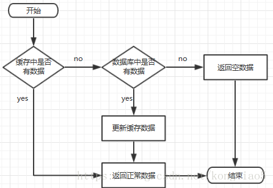
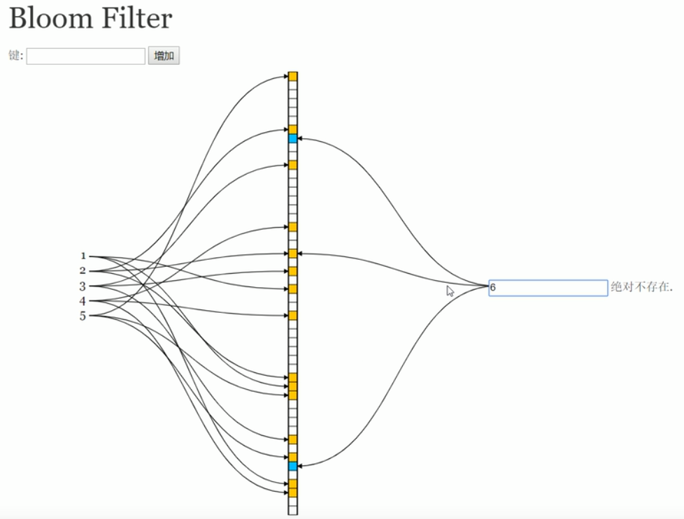

#### 1.五种数据类型

int

String

hash

Set

Sorted Set


#### 2.查看内存中所有的key

```shell
keys *
```

#### 3.设置key的过期时间

```shell
expire key的名称 秒数（多少秒后过期）
```

#### 4.查看指定key的过期时间

```shell
ttl key名称
```

key的过期时间若为 **-1**，则表示该key是持久化的；

若为 **-2** ，则表示不存在该key;若为其他 **正整数**，则表示该key的存活时间。

将非持久化的key转换成持久化:

```shell
Persist key名称
```


### 5.使用客户端redis-cli连接已开启的redis（包括本地和远程的redis）,

* 连接本地redis

```shell
./redis-cli  #此处已经在bin目录下，所以是写的./
```

* 连接远程redis

  ```shell
  ./redis-cli -h 远程主机的ip -p 远程主机的redis端口号
  ```


### 6.redis集群

#### ”投票“机制

​	产生原因：集群中出现某节点Down掉时，此时会由其余的各节点”投票“，当多数（超过半数）节点都认为该节点down掉时（每个节点都去ping-pong一下该节点），此时该节点就是真的down掉了。正因这种”投票“机制，所以redis的集群搭建至少需要3个主节点，要保证集群的高可用，需要每个节点有一个备份机。


redis集群中，每个节点保存的数据是不一样的。那么在存数据时，应该怎么才能保证均匀地往每个节点存入数据呢？

```
Redis 集群中内置了 16384 个哈希槽，当需要在 Redis 集群中放置一个 key-value 时，redis 先对 key 使用 crc16 算法算出一个结果，然后把结果对 16384 求余数，这样每个 key 都会对应一个编号在 0-16383 之间的哈希槽，redis 会根据节点数量大致均等的将哈希槽映射到不同的节点
```


### 7.搭建集群(伪集群，在同一台服务器上运行多个不同端口的redis实例)

1. 修改配置文件。先在第一个redis文件——redis01的bin目录下的redis.conf文件中修改端口号port为6001（端口号随便写）。然后还要将cluster-enable  no 设置成 yes,这是允许集群的意思。

2. 复制。将redis01复制五份（该集群一个6个节点），分别是redis02~redis06.

3. 编写启动集群的批处理文件。在这6个节点的同一目录下创建一个用于一次性启动所有的节点的批处理文件（.sh文件）。

4. 将redis源码文件中的redis-trib.rb文件拷贝到节点所在目录。

5. 安装ruby(用于运行第四步中的redis-trib.rb文件)，`yum install ruby`和`yum install rubygems`

6. 安装与当前redis同版本的`.gem文件`。

7. 使用ruby文件创建集群。该步骤会先创建各个节点，然后规划主节点和备份节点，并且为每个主节点分配哈希槽。

   ```shell
   #执行如下命令
   ./redis-trib.rb create --replicas 1 192.168.25.129:7001 192.168.25.129:7002 192.168.25.129:7003 192.168.25.129:7004 192.168.25.129:7005 192.168.25.129:7006
   #参数分析
   #--replicas后面的 1 表示每个主节点有一个备份节点
   #后面的IP:端口号表示每台服务器上的redis，因为此处是伪集群，所以IP相同。
   ```

8. 使用客户端连接集群。在上面的集群创建好了之后，接着就开始连接了，连接之前确认集群是否启动（用上面的批量处理文件启动）。然后随便进入一个节点，启动里面的客户端文件，启动命令如下：

   ```shell
   #连接至端口号为7003的节点
   ./redis-cli -p 7003 -c
   #参数分析：
   #-p 指定端口 ；  -c 指定是集群
   ```

### 8 . 缓存穿透

##### 出现缓存穿透的原因：

查询缓存和数据库中都不存在的数据

##### 缓存穿透可能导致的结果：

​	想象一下这个情况，如果传入的参数为-1，会是怎么样？这个-1，就是一定不存在的对象。就会每次都去查询数据库，而每次查询都是空，每次又都不会进行缓存。假如有恶意攻击，就可以利用这个漏洞，对数据库造成压力，甚至压垮数据库。即便是采用UUID，也是很容易找到一个不存在的KEY，进行攻击。

##### 缓存处理流程：



##### 解决思路：

从缓存穿透导致的结果来看，有两种解决思路：

​	1.  当使用无效参数第一次访问数据库后，就把该无效参数放入缓存中，其value设为null,这样的话，同一个无效参数第二次先去查缓存的时候就会得到null值，而不会再访问数据库。但是这种方法治标不治本，想想，如果每次进来的参数不同，且这些参数都是无效的参数，它们都有各自的”第一次“那么就都会去查数据库，访问量大的时候，这些所谓的“第一次无效参数”就会给数据库带来很大的压力。

​	2.这次先不走缓存，而是先走布隆过滤器，布隆过滤器中会事先存放数据库中每个数据对应的id的映射，当每次查数据时，就会先去查这个布隆过滤器中是否可能存在这个id的映射，如果存在，就放行，接着就执行缓存的流程。如果不存在，就返回一个空。

##### 解决办法：

1. 缓存空值

2. 采用布隆过滤器

   - 布隆过滤器--谷歌版

     加入依赖：

     ```
     <dependency>
             <groupId>com.google.guava</groupId>
             <artifactId>guava</artifactId>
             <version>23.5-jre</version>
     </dependency>
     ```

     在程序中定义布隆过滤器：

     ```java
     private static int size = 插入大小；
     private static BloomFilter<Integer> bloomFilter = BloomFilter.create(Funnels.integerFunnel(),size,0.1);
     ```


 底层原理：

 	布隆过滤器的底层原理是通过外部提供的参数`容错率`和`插入大小（数据库中有多少条数据）`动态生成一个bit向量或者说bit数组，然后将数据添加到过滤器中，如下图中数字1~5是数据库中事先准备好的每条数据的id，但是布隆过滤器中实际存储的并不是每条数据的id，而是id对应的映射。每存一个数据，布隆过滤器底层都会由传入的`容错率`和`插入大小（数据库中有多少条数据）`计算出所需要的`数组大小`，再由得到的`数组大小`和`插入大小`计算出所需的`hash函数个数`。

 	不同的`hash函数`对同一个值hash时，就会有不同的hash值，然后再将这些hash值对`数组大小`取余，得到的值就是数组中的存放位置（索引），然后在这些位置上存`1`。当查找某个值是否存在的时候，若hash出来的位置里面有不是`1`的，那就说明所要查找的值`一定不存在`；若全是`1`，也只能说`可能存在`该值，在[图四](assets/1567333737152.png)中即可看出。

 注意：

  1. 在布隆过滤器中，存的只是数据的映射，而不是真是的数据值；
  2. 在布隆过滤器中，不存在删除某个映射的操作

原理演示图：

 存映射：

 

 								图一

 查询：

 

 								图二

 查询：

 

 								图三

 查询：

 

 								图四 

 容错率、插入大小、数组大小、hash函数个数之间的关系：

 插入大小不变时，容错率越小，则数组越大，hash函数越多。

 容错率越小，可拦截的非法请求参数就越多，但是布隆过滤器底层分配的数组就越大，就越占用内存空间。

   - 布隆过滤器--自定义版

     利用redis实现布隆过滤器

     关键方法：setbit,getbit


### 9.布隆过滤器的使用场景：

1. 网页爬虫对URL的去重，避免爬取相同的URL地址
2. 反垃圾邮件，从数十亿个垃圾邮件列表中判断某邮箱是否垃圾邮箱（同理，垃圾短信）
3. 缓存穿透，将所有可能存在的数据缓存放到布隆过滤器中，当黑客访问不存在的缓存时迅速返回避免缓存及DB挂掉。

### 10.缓存击穿

##### 出现缓存击穿的原因：

​	缓存击穿，是指一个key非常热点，在不停的扛着大并发，大并发集中对这一个点进行访问，当这个key在失效的瞬间，持续的大并发就穿破缓存，直接请求数据库，就像在一个屏障上凿开了一个洞。

#### 可能导致的结果：

​	DB挂掉。

#### 解决方法：

​	1.将热点数据的key的过期时间设为永不过期

​	2.加JVM锁（简单的同步代码块）

​		缺点：所对象太大，有可能把其他数据也锁上

​	3.加分布式锁（当服务部署在多态服务器上时）

​		优点：只锁单个数据

### 11.缓存雪崩

#### 出现缓存雪崩的原因：

​	1.某一个时间段，缓存集中过期失效。

​	产生雪崩的原因之一，比如在写本文的时候，马上就要到双十二零点，很快就会迎来一波抢购，这波商品时间比较集中的放入了缓存，假设缓存一个小时。那么到了凌晨一点钟的时候，这批商品的缓存就都过期了。而对这批商品的访问查询，都落到了数据库上，对于数据库而言，就会产生周期性的压力波峰。

​	2.缓存服务器宕机。

​	其实集中过期，倒不是非常致命，比较致命的缓存雪崩，是缓存服务器某个节点宕机或断网。因为自然形成的缓存雪崩，一定是在某个时间段集中创建缓存，那么那个时候数据库能顶住压力，这个时候，数据库也是可以顶住压力的。无非就是对数据库产生周期性的压力而已。而缓存服务节点的宕机，对数据库服务器造成的压力是不可预知的，很有可能瞬间就把数据库压垮。

​	

#### 可能导致的结果：

​	DB挂掉。

#### 解决方法：

​	以电商项目为例，一般是采取不同分类商品，缓存不同周期。在同一分类中的商品，加上一个随机因子。这样能尽可能分散缓存过期时间，而且，热门类目的商品缓存时间长一些，冷门类目的商品缓存时间短一些，也能节省缓存服务的资源。