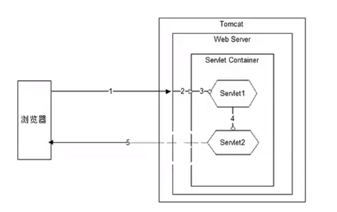
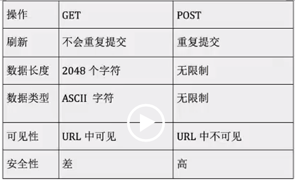

#### 1.请求的处理流程

#### 2.servlet的执行流程

​	1.当servlet被容器装载并实例化（在浏览器第一次发送请求时实例化servlet）后，init方法首先被调用（当有参和无参的方法同时存在时，先调用有参的init方法后调用无参的init方法）且在整个servlet的生命周期中，该方法只会被调用一次。只有在init方法被调用，servlet在开始处于服务状态，接受客户端请求。

​	2.调用service方法。在整个servlet生命周期中，该方法可以被调用多次，这跟请求的次数有关。

​	3.调用destroy方法。当servlet不再使用，容器销毁servlet之前会调用该方法，该方法也只会调用一次。

#### 3.GET和POST请求的区别

### 解释说明：

### 	刷新。在刷新网页时，如果是post提交，则浏览器会提示用户是否重复提交。数据长度。指的是向URL中添加数据的数据长度。数据类型。post提交可实现文件图像的上传，get则不行。

#### 4.过滤器

##### 	过滤器是在servlet启动时启动。在过滤器启动时，会先调用过滤器的构造函数，然后调用过滤器的init方法，接着开始执行servlet的init方法，随后又调用过滤器的doFilter方法，在过滤器的doFilter方法中，通过参数传进来的FilterChain对象会调用他自己的doFilter方法，该方法的参数是外层doFilter传进来的ServletRequest对象和ServletResponse对象，通过这个内层的doFilter方法可以转去执行后面的过滤器，若果后面没有过滤器了，那么接着就开始去执行servlet中的service方法了，当servlet中的service方法执行完毕就会回到过滤器中执行后面的逻辑。（当存在多个过滤器时，这些过滤器的执行顺序是按照配置文件中的配置先后顺序来执行）