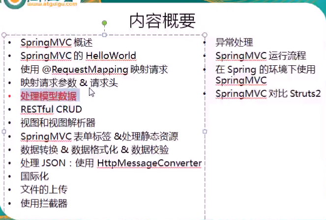

#### 1.

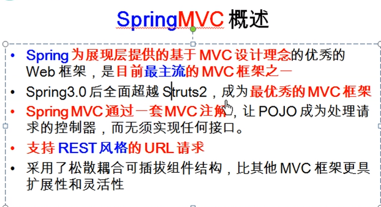

#### 2.

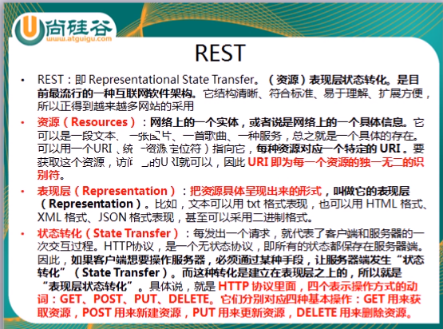

#### 3.

#### 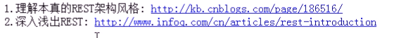

#### 4.

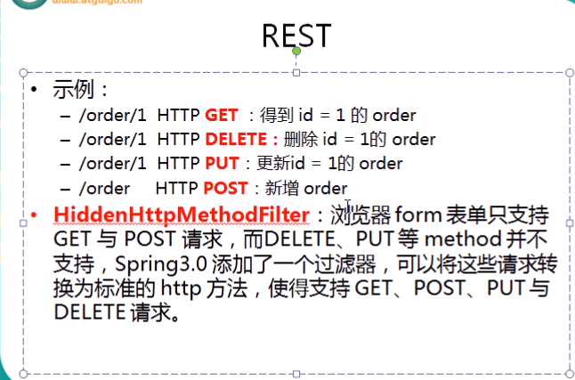

#### 5.

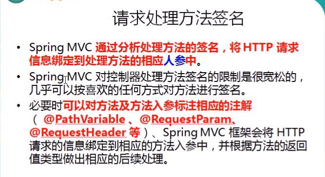

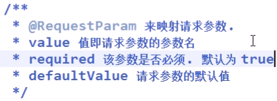

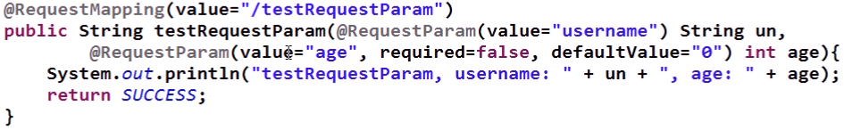

#### 6.

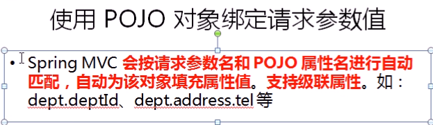

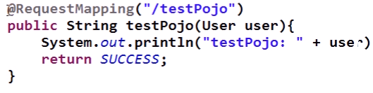

#### 7.

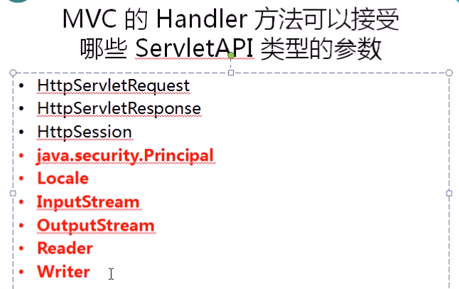

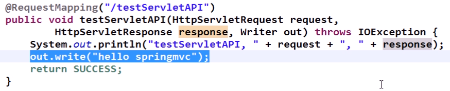

#### 8.

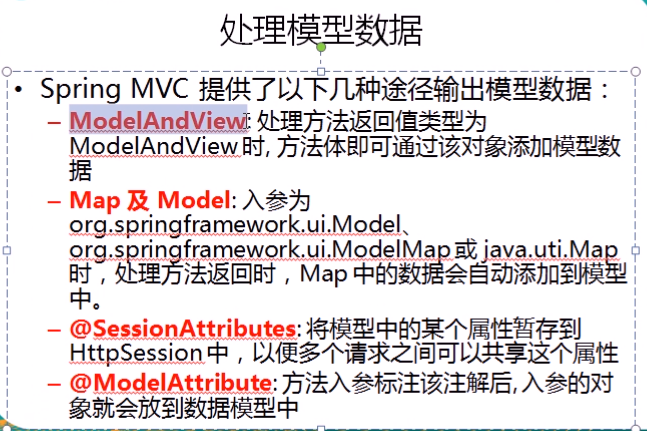

##### （1.1）把模型数据放在Request请求域中

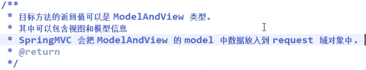

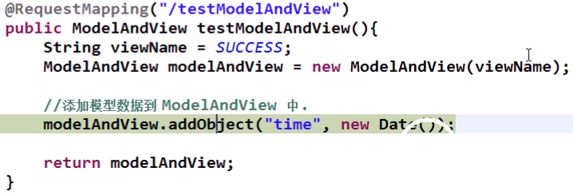

##### 然后在前端获取通过modelAndView储存在request域中的数据：

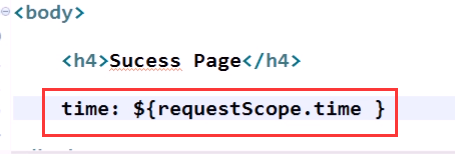

##### （1.2）把模型数据放在Request请求域中

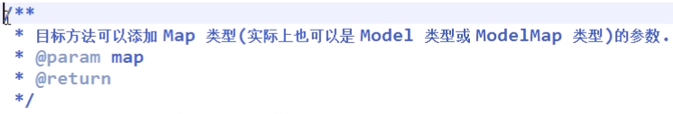

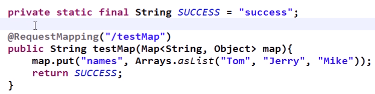

##### （2.1）把模型数据放在Session请求域中

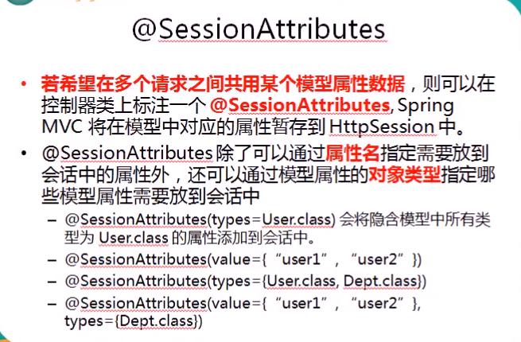

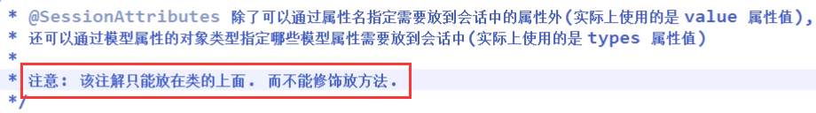

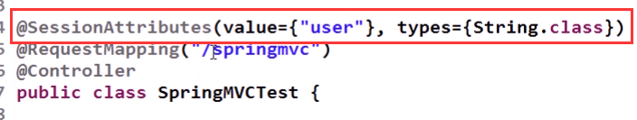

#####  在前端获取通过modelAndView储存在Session域中的数据：

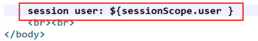

##### 网页上显示结果：

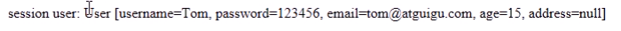

##### （3.1）

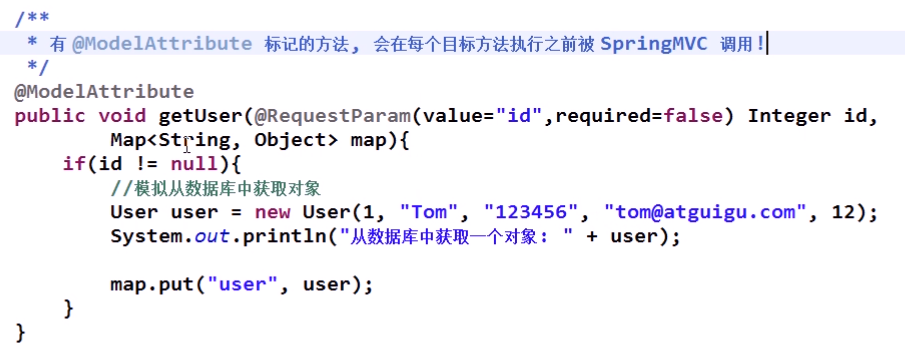

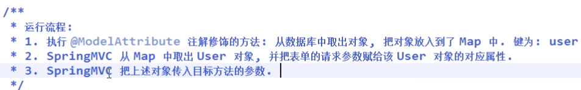

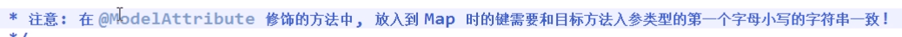

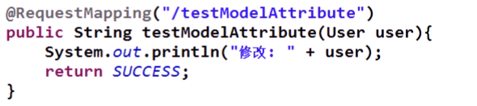

##### 9.Handler和Controller的区别

Handler是controller中的方法，而controller是整个@controller类