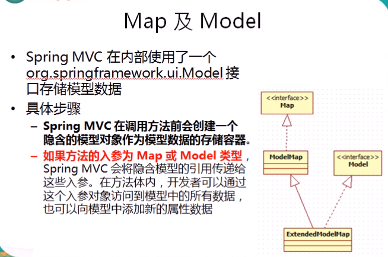
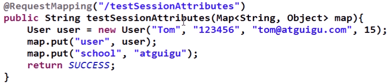

#### 1.

#### 2.

#### 3.

#### 

#### 4.

#### 5.

#### 6.

#### 7.

#### 8.

##### （1.1）把模型数据放在Request请求域中

##### 然后在前端获取通过modelAndView储存在request域中的数据：

##### （1.2）把模型数据放在Request请求域中

##### （2.1）把模型数据放在Session请求域中

#####  在前端获取通过modelAndView储存在Session域中的数据：

##### 网页上显示结果：

##### （3.1）

##### 9.Handler和Controller的区别

Handler是controller中的方法，而controller是整个@controller类