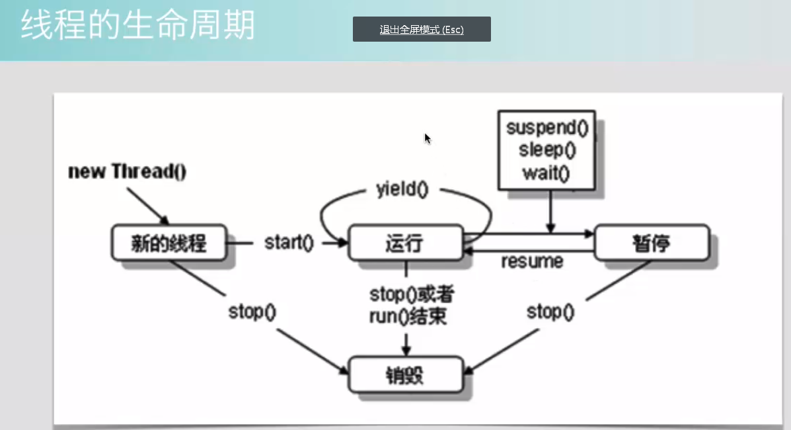

### 并发编程的三个重要特性

- 原子性。不可分割
- 可见性。必须确保在锁被释放之前，对共享变量所做的修改，对于随后获得该锁的另一个线程是可见的（即在获得锁时应获得最新共享变量的值），否则另一个线程可能是在本地缓存的某个副本上继续操作从而引起不一致。**脏读就是一种没有遵循这种可见性所造成的结果**。
- 有序性。程序中的顺序不一定就是执行的顺序，因为存在编译重排序、指令重排序，这样是为了提高效率。

### 计算机中线程间的通信的两种方式

- 线程间直接通信
- 通过内存共享来通信

### 线程的生命周期

### 守护线程

守护线程是依赖主线程的,即主线程结束，守护线程也就结束。

### synchronized

锁定的对象：

- 类的实例 （this|object）
- 类的类对象（class对象）

tips:

- 加了`synchronized`之后不一定能实现线程安全，具体还要看锁定的对象是否唯一。
- 在同步方法中出现异常且没有处理，则锁会被释放。

#### 偏向锁

#### 轻量级锁

#### 重量级锁

#### 自旋锁

#### 重入锁

1. 一个同步方法中调用另外一个同步方法时，如果锁对象相同，则可以重入，否则造成死锁。
2. 子类调用父类的同步方法，也可以实现重入。

### volatile

tips:

- 只能保证可见性，不能保证原子性。